# Accessing Remote Computers

There are really two scenarios for accessing a remote computer. The difference between those scenarios primarily lies in the answer to one question: Can WinRM identify and authenticate the remote machine?

Obviously, the remote machine needs to know who you are, because it will be executing commands on your behalf. But you need to know who it is, as well. This mutual authentication - e.g., you authenticate each other - is an important security step. It means that when you type SERVER2, you're really connecting to the real SERVER2, and not some machine pretending to be SERVER2. Lots of folks have posted blog articles on how to disable the various authentication checks. Doing so makes Remoting "just work" and gets rid of pesky error messages - but also shuts off security checks and makes it possible for someone to "hijack" or "spoof" your connection and potentially capture sensitive information - like your credentials.

**Caution:** Keep in mind that Remoting involves delegating a credential to the remote computer. You're doing more than just sending a username and password \(which doesn't actually happen all of the time\): you're giving the remote machine the ability to execute tasks as if you were standing there executing them yourself. An imposter could do a lot of damage with that power. That is why Remoting focuses on mutual authentication - so that imposters can't happen.

In the easiest Remoting scenarios, you're connecting to a machine that's in the same AD domain as yourself, and you're connecting by using its real computer name, as registered with AD. AD handles the mutual authentication and everything works. Things get harder if you need to:

* Connect to a machine in another domain
* Connect to machine that isn't in a domain at all
* Connect via a DNS alias, or via an IP address, rather than via the machine's actual computer name as registered with AD

In these cases, AD can't do mutual authentication, so you have to do it yourself. You have two choices:

* Set up the remote machine to accept HTTPS \(rather than HTTP\) connections, and equip it with an SSL certificate. The SSL certificate must be issued by a Certification Authority \(CA\) that your machine trusts; this enables the SSL certificate to provide the mutual authentication WinRM is after.
* Add the remote machine's name \(whatever you're specifying, be it a real computer name, an IP address, or a CNAME alias\) to your local computer's WinRM TrustedHosts list. Note that this basically disables mutual authentication: You're allowing WinRM to connect to that one identifier \(name, IP address, or whatever\) without mutual authentication. This opens the possibility for a machine to pretend to be the one you want, so use due caution.

In both cases, you also have to specify a -Credential parameter to your Remoting command, even if you're just specifying the same credential that you're using to run PowerShell. We'll cover both cases in the next two sections.

**Note:** Throughout this guide, we'll use "Remoting command" to generically refer to any command that involves setting up a Remoting connection. Those include \(but are not limited to\) New-PSSession, Enter-PSSession, Invoke-Command, and so on.

## Setting up an HTTPS Listener

This is one of the more complex things you can do with Remoting, and will involve running a lot of external utilities. Sorry - that's just the way it's done! Right now there doesn't seem to be an easy way to do this entirely from within PowerShell, at least not that we've found. Some things, as you'll see, could be done through PowerShell, but are more easily done elsewhere - so that's what I've done.

Your first step is to identify the host name that people will use to access your server. This is very, very important, and it isn't necessarily the same as the server's actual computer name. For example, folks accessing "www.ad2008r2.loc" might in fact be hitting a server named "DC01," but the SSL certificate you'll create must be issued to host name "www.ad2008r2.loc" because that's what people will be typing. So, the certificate name needs to match whatever name people will be typing to get to the machine - even if that's different from its true computer name. Got that?

**Note:** As the above implies, part of setting up an HTTPS listener is obtaining an SSL certificate. I'll be using a public Certification Authority \(CA\) named DigiCert.com. You could also use an internal PKI, if your organization has one. I don't recommend using MakeCert.exe, since such a certificate can't be implicitly trusted by the machines attempting to connect. I realize that every blog in the universe tells you to use MakeCert.exe to make a local self-signed certificate. Yes, it's easy - but it's wrong. Using it requires you to shut off most of WinRM's security - so why bother with SSL if you plan to shut off most of its security features?

You need to make sure you know the full name used to connect to a computer, too. If people will have to type "dc01.ad2008r2.loc," then that's what goes into the certificate. If they'll simply need to provide "dca," and know that DNS can resolve that to an IP address, then "dca" is what goes into the certificate. We're creating a certificate that just says "dca" and we'll make sure our computers can resolve that to an IP address.

#### Creating a Certificate Request

Unlike IIS, PowerShell doesn't offer a friendly, graphical way of creating a Certificate Request \(or, in fact, any way at all to do so.\) So, go to [http://DigiCert.com/util](http://DigiCert.com/util) and download their free certificate utility. Figure 2.1 shows the utility. Note the warning message.

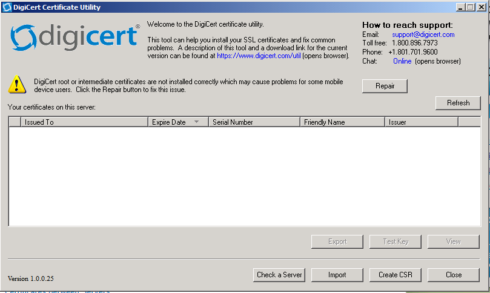

Figure 2.1: Launching DigiCertUtil.exe

You only need to worry about this warning if you plan to acquire your certificate from the DigiCert CA; click the Repair button to install their intermediate certificates on your computer, enabling their certificate to be trusted and used. Figure 2.2 shows the result of doing so. Again, if you plan to take the eventual Certificate Request \(CSR\) to a different CA, don't worry about the Repair button or the warning message.

Note You can also open a blank MMC console and add Windows' "Certificate" snap-in. Focus it on the computer account for the local computer \(you'll be prompted\). Then, right-click on the "Personal" folder and select All Tasks to find the option to create a new certificate request.  
:  
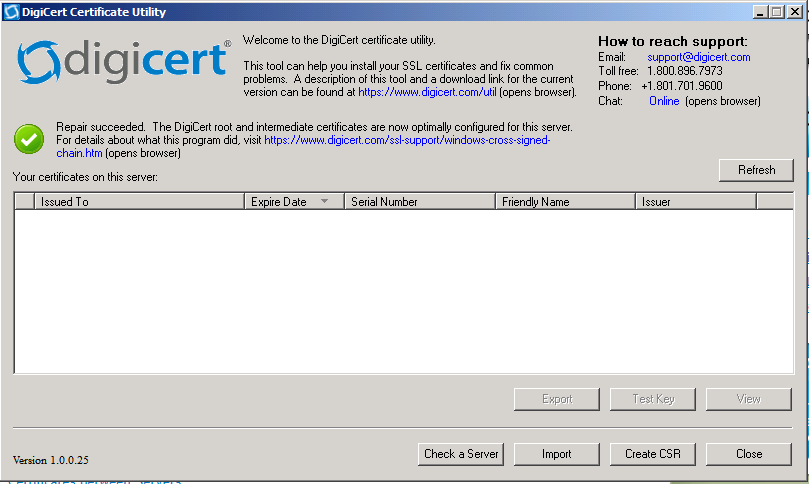

Figure 2.2: After adding the DigiCert intermediate certificates

Click "Create CSR." As shown in figure 2.3, fill in the information about your organization. This needs to be exact: The "Common Name" is exactly what people will type to access the computer on which this SSL certificate will be installed. That might be "dca," in our case, or "dc01.ad20082.loc" if a fully qualified name is needed, and so on. Your company name also needs to be accurate: Most CAs will verify this information.

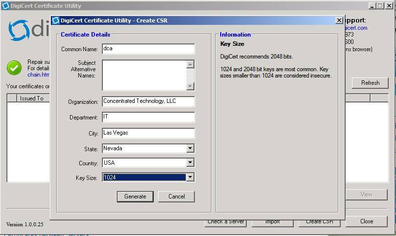

Figure 2.3: Filling in the CSR

We usually save the CSR in a text file, as shown in figure 2.4. You can also just copy it to the Clipboard in many cases. When you head to your CA, make sure you're requesting an SSL \("Web Server," in some cases\) certificate. An e-mail certificate or other type won't work.

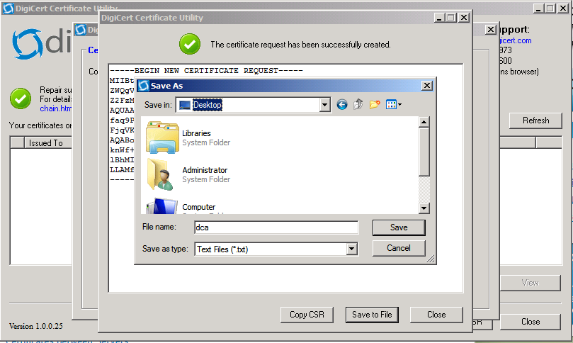

Figure 2.4: Saving the CSR into a text file

Next, take that CSR to your CA and order your certificate. This will look something like figure 2.5 if you're using DigiCert; it'll obviously be different with another CA, with an internal PKI, and so forth. Note that with most commercial CAs you'll have to select the type of Web server you're using; choose "Other," if that's an option, or "IIS" if not.

**Note:** Using the MakeCert.exe utility from the Windows SDK will generate a local certificate that only your machine will trust. This isn't useful. Folks tell you to do this in various blog posts because it's quick and easy; they also tell you to disable various security checks so that the inherently-useless certificate will work. It's a waste of time. You're getting encryption, but you've no assurance that the remote machine is the one you intended to connect to in the first place. If someone's hijacking your information, who cares if it was encrypted before you sent it to them?

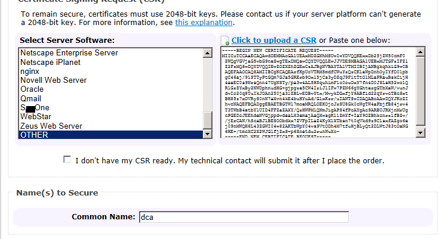

Figure 2.5: Uploading the CSR to a CA

**Caution:** Note the warning message in figure 2.5 that my CSR needs to be generated with a 2048-bit key. DigiCert's utility offered me that, or 1024-bit. Many CAs will have a high-bit requirement; make sure your CSR complies with what they need. Also notice that this is a Web server certificate we're applying for; as we wrote earlier, it's the only kind of certificate that will work.

Eventually, the CA will issue your certificate. Figure 2.6 shows where we went to download it. We chose to download all certificates; we wanted to ensure we had a copy of the CA's root certificate, in case we needed to configure another machine to trust that root.

**Tip:** The trick with digital certificates is that the machine using them, and any machines they will be presented to, need to trust the CA that issued the certificate. That's why you download the CA root certificate: so you can install it on the machines that need to trust the CA. In a large environment, this can be done via Group Policy, if desired.

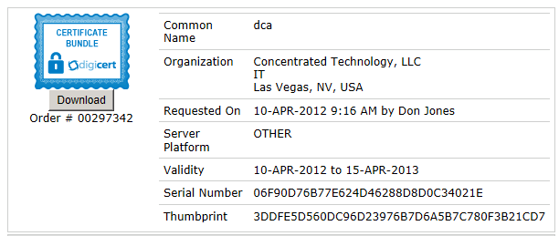

Figure 2.6: Downloading the issued certificate

Make sure you back up the certificate files! Even though most CAs will re-issue them as needed, it's far easier to have a handy backup, even on a USB flash drive.

#### Installing the Certificate

Don't try to double-click the certificate file to install it. Doing so will install it into your user account's certificate store; you need it in your computer's certificate store instead. To install the certificate, open a new Microsoft Management Console \(mmc.exe\), select Add/Remove Snap-ins, and add the Certificates snap-in, as shown in figure 2.7.

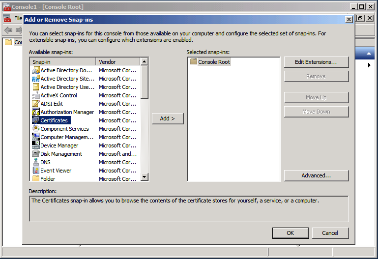

Figure 2.7: Adding the Certificates snap-in to the MMC

As shown in figure 2.8, focus the snap-in on the Computer account.

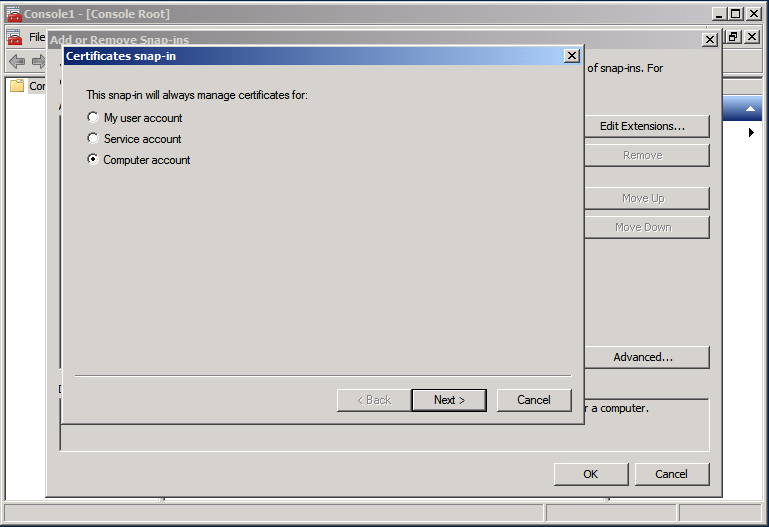

Figure 2.8: Focusing the Certificates snap-in on the Computer account

Next, as shown in figure 2.9, focus on the local computer. Of course, if you're installing a certificate onto a remote computer, focus on that computer instead. This is a good way to get a certificate installed onto a GUI-less Server Core installation of Windows, for example.

**Note:** We wish we could show you a way to do all of this from within PowerShell. But we couldn't find one that didn't involve a jillion more, and more complex, steps. Since this hopefully isn't something you'll have to do often, or automate a lot, the GUI is easier and should suffice.

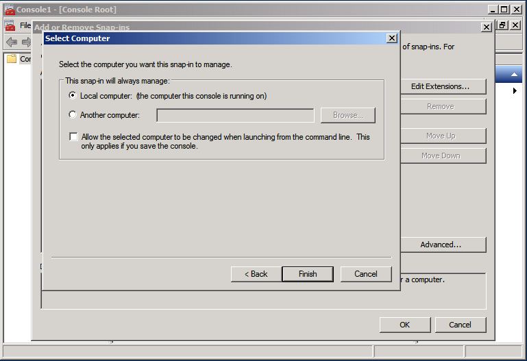

Figure 2.9: Focusing the Certificates snap-in on the local computer

With the snap-in loaded, as shown in figure 2.10, right-click the "Personal" store and select "Import."

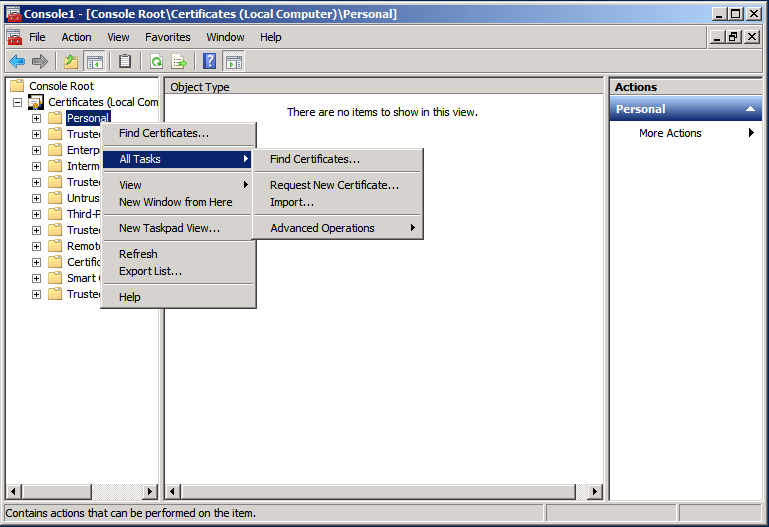

Figure 2.10: Beginning the import process into the Personal store

As shown in figure 2.11, browse to the certificate file that you downloaded from your CA. Then, click Next.

**Caution:** If you downloaded multiple certificates - perhaps the CA's root certificates along with the one issued to you - make sure you're importing the SSL certificate that was issued to you. If there's any confusion, STOP. Go back to your CA and download just YOUR certificate, so that you'll know which one to import. Don't experiment, here - you need to get this right the first time.

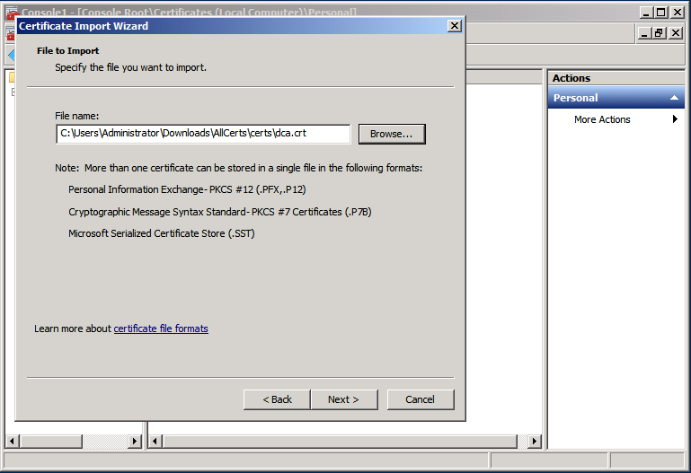

Figure 2.11: Selecting the newly-issued SSL certificate file

As shown in figure 2.12, ensure that the certificate will be placed into the Personal store.

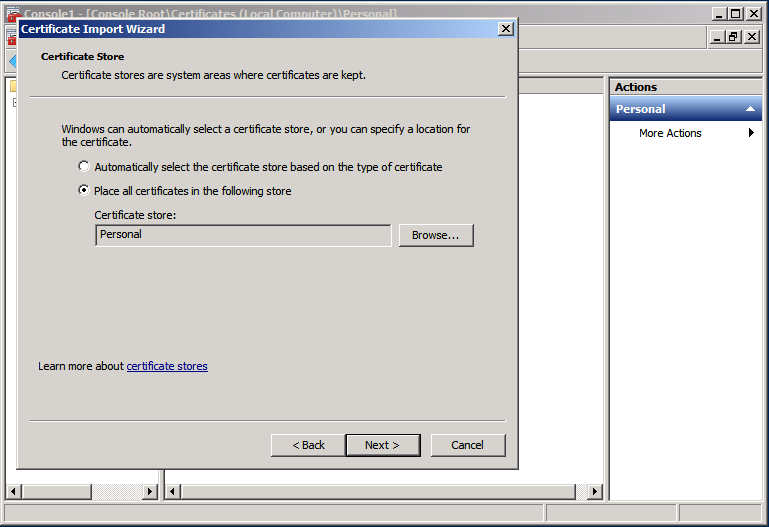

Figure 2.12: Be sure to place the certificate into the Personal store, which should be pre-selected.

As shown in figure 2.13, double-click the certificate to open it. Or, right-click and select Open. Do not select Properties - that won't get you the information you need.

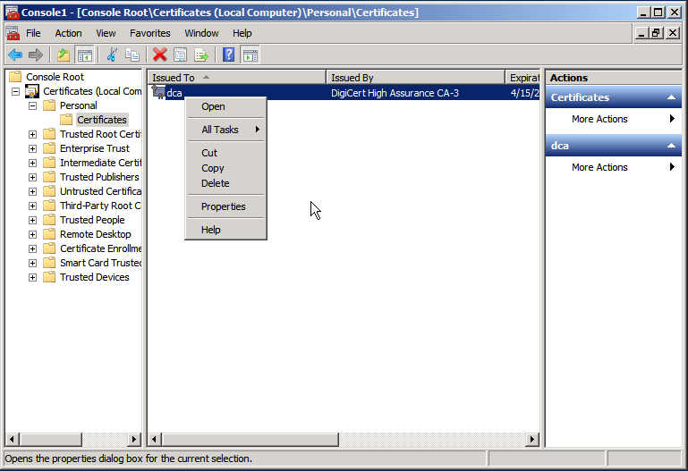

Figure 2.13: Double-click the certificate, or right-click and select Open

Finally, as shown in figure 2.14, select the certificate's thumbprint. You'll need to either write this down, or copy it to your Clipboard. This is how WinRM will identify the certificate you want to use.

**Note:** It's possible to list your certificate in PowerShell's CERT: drive, which will make the thumbprint a bit easier to copy to the Clipboard. In PowerShell, run Dir CERT:\LocalMachine\My and read carefully to make sure you select the right certificate. If the entire thumbprint isn't displayed, run Dir CERT:\LocalMachine\My \| FL \* instead.

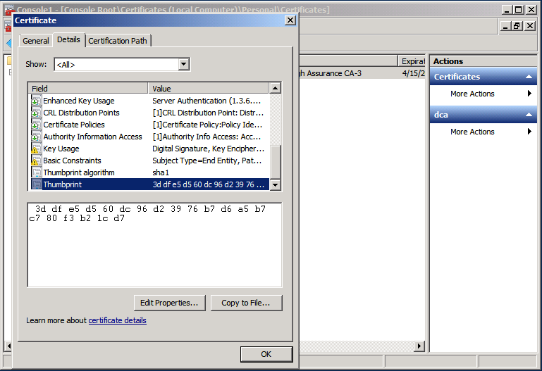

Figure 2.14: Obtaining the certificate's thumbprint

#### Setting up the HTTPS Listener

These next steps will be accomplished in the Cmd.exe shell, not in PowerShell. The command-line utility's syntax requires significant tweaking and escaping in PowerShell, and it's a lot easier to type and understand in the older Cmd.exe shell \(which is where the utility has to run anyway; running it in PowerShell would just launch Cmd.exe behind the scenes\).

As shown in figure 2.15, run the following command:

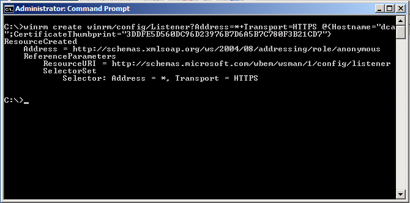

Figure 2.15: Setting up the HTTPS WinRM listener

```
Winrm create winrm/config/Listener?Address=\*+Transport=HTTPS @{Hostname="xxx";CertificateThumbprint="yyy"}
```

There are two or three pieces of information you'll need to place into this command:

* In place of \*, you can put an individual IP address. Using \* will have the listener listen to all local IP addresses.
* In place of xxx, put the exact computer name that the certificate was issued to. If that includes a domain name \(such as dc01.ad2008r2.loc\), put that. Whatever's in the certificate must go here, or you'll get a CN mismatch error. Our certificate was issued to "dca," so I put "dca."
* In place of yyy, put the exact certificate thumbprint that you copied earlier. It's okay if this contains spaces.

That's all you should need to do in order to get the listener working.

**Note:** We had the Windows Firewall disabled on this server, so we didn't need to create an exception. The exception isn't created automatically, so if you have any firewall enabled on your computer, you'll need to manually create the exception for port 5986.

You can also run an equivalent PowerShell command to accomplish this task:

```
New-WSManInstance winrm/config/Listener -SelectorSet @{Address='\*';
Transport='HTTPS'} -ValueSet @{HostName='xxx';CertificateThumbprint='yyy'}
```

In that example, "xxx" and "yyy" get replaced just as they did in the previous example.

#### Testing the HTTPS Listener

I tested this from the standalone C3925954503 computer, attempting to reach the DCA domain controller in COMPANY.loc. I configured C3925954503 with a HOSTS file, so that it could resolve the hostname DCA to the correct IP address without needing DNS. I was sure to run:

```
Ipconfig /flushdns
```

This ensured that the HOSTS file was read into the DNS name cache. The results are in figure 2.16. Note that I can't access DCA by using its IP address directly, because the SSL certificate doesn't contain an IP address. The SSL certificate was issued to "dca," so we need to be able to access the computer by typing "dca" as the computer name. Using the HOSTS file will let Windows resolve that to an IP address.

**Note:** Remember, there are two things going on here: Windows needs to be able to resolve the name to an IP address, which is what the HOSTS file accomplishes, in order to make a physical connection. But WinRM needs mutual authentication, which means whatever we typed into the -ComputerName parameter needs to match what's in the SSL certificate. That's why we couldn't just provide an IP address to the command - it would have worked for the connection, but not the authentication.

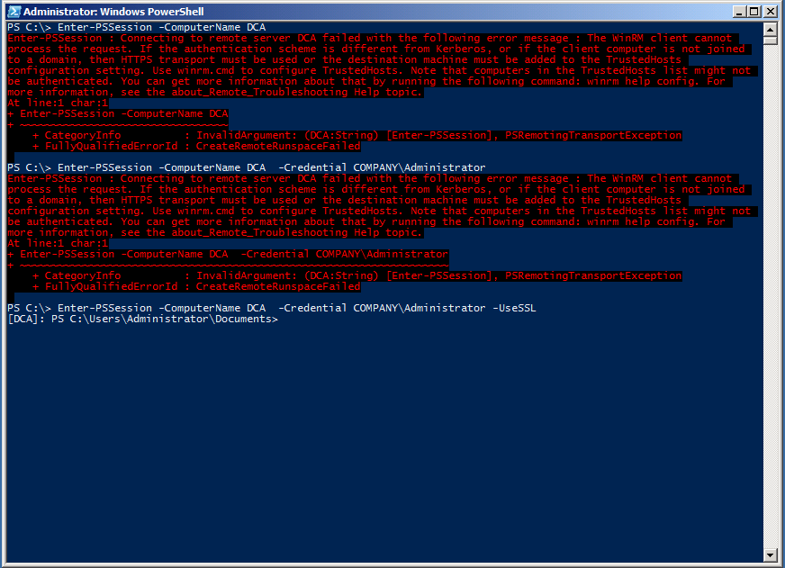

Figure 2.16: Testing the HTTPS listener

We started with this:

```
Enter-PSSession -computerName DCA
```

It didn't work - which I expected. Then we tried this:

```
Enter-PSSession -computerName DCA -credential COMPANY\Administrator
```

We provided a valid password for the Administrator account, but as expected the command didn't work. Finally:

```
Enter-PSSession -computerName DCA -credential COMPANY\Administrator -UseSSL
```

Again providing a valid password, we were rewarded with the remote prompt we expected. It worked! This fulfills the two conditions we specified earlier: We're using an HTTPS-secured connection _and_ providing a credential. Both conditions are required because the computer isn't in my domain \(since in this case the source computer isn't even in a domain\). As a refresher, figure 2.17 shows, in green, the connection we created and used.

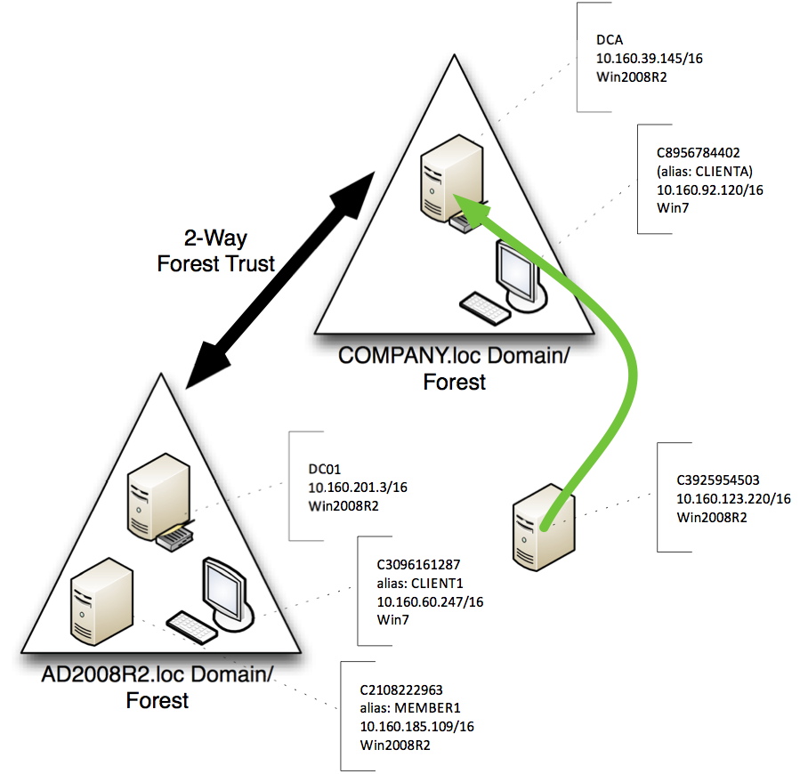

Figure 2.17: The connection used for the HTTPS listener test

#### Modifications

There are two modifications you can make to a connection, whether using Invoke-Command, Enter-PSSession, or some other Remoting command, which relate to HTTPS listeners. These are created as part of a session option object.

* -SkipCACheck causes WinRM to not worry about whether the SSL certificate was issued by a trusted CA or not. However, untrusted CAs may in fact be untrustworthy! A poor CA might issue a certificate to a bogus computer, leading you to believe you're connecting to the right machine when in fact you're connecting to an imposter. This is risky, so use it with caution.
* -SkipCNCheck causes WinRM to not worry about whether the SSL certificate on the remote machine was actually issued for that machine or not. Again, this is a great way to find yourself connected to an imposter. Half the point of SSL is mutual authentication, and this parameter disables that half.

Using either or both of these options will still enable SSL encryption on the connection - but you'll have defeated the other essential purpose of SSL, which is mutual authentication by means of a trusted intermediate authority.

To create and use a session object that includes both of these parameters:

```
$option = New-PSSessionOption -SkipCACheck -SkipCNCheck
Enter-PSSession -computerName DCA -sessionOption $option
        -credential COMPANY\Administrator -useSSL
```

**Caution:** Yes, this is an easy way to make annoying error messages go away. But those errors are trying to warn you of a potential problem and protect you from potential security risks that are very real, and which are very much in use by modern attackers.

## Certificate Authentication

Once you have an HTTPS listener set up, you have the option of authenticating with Certificates. This allows you to connect to remote computers, even those in an untrusted domain or workgroup, without requiring either user input or a saved password. This may come in handy when scheduling a task to run a PowerShell script, for example.

In Certificate Authentication, the client holds a certificate with a private key, and the remote computer maps that certificate's public key to a local Windows account. WinRM requires a certificate which has "Client Authentication \(1.3.6.1.5.5.7.3.2\)" listed in the Enhanced Key Usage attribute, and which has a User Principal Name listed in the Subject Alternative Name attribute. If you're using a Microsoft Enterprise Certification Authority, the "User" certificate template meets these requirements.

#### Obtaining a certificate for client authentication

These instructions assume that you have a Microsoft Enterprise CA. If you are using a different method of certificate enrollment, follow the instructions provided by your vendor or CA administrator.

On your client computer, perform the following steps:

* Run certmgr.msc to open the "Certificates - Current User" console.
* Right click on the "Personal" node, and select All Tasks -&gt; Request New Certificate& 
* In the Certificate Enrollment dialog, click Next. Highlight "Active Directory Enrollment Policy", and click Next again. Select the User template, and click Enroll.


Figure 2.18: Requesting a User certificate.

After the Enrollment process is complete and you're back at the Certificates console, you should now see the new certificate in the Personal\Certificates folder:

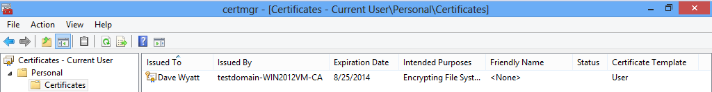

Figure 2.19: The user's installed Client Authentication certificate.

Before closing the Certificates console, right-click on the new certificate, and choose All Tasks -&gt; Export. In the screens that follow, choose "do not export the private key", and save the certificate to a file on disk. Copy the exported certificate to the remote computer, for use in the next steps.

#### Configuring the remote computer to allow Certificate Authentication

On the remote computer, run the PowerShell console as Administrator, and enter the following command to enable Certificate authentication:

```
Set-Item -Path WSMan:\localhost\Service\Auth\Certificate -Value $true
```

#### Importing the client's certificate on the remote computer

The client's certificate must be added to the machine "Trusted People" certificate store. To do this, perform the following steps to open the "Certificates \(Local Computer\)" console:

* Run "mmc".
* From the File menu, choose "Add/Remove Snap-in."
* Highlight "Certificates", and click the Add button.
* Select the "Computer Account" option, and click Next.
* Select "Local Computer", and click Finish, then click OK.

**Note:** This is the same process you followed in the "Installing the Certificate" section under Setting up and HTTPS Listener. Refer to figures 2.7, 2.8 and 2.9 if needed.

In the Certificates \(Local Computer\) console, right-click the "Trusted People" store, and select All Tasks -&gt; Import.

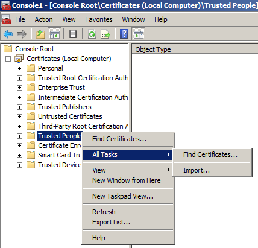

Figure 2.20: Starting the Certificate Import process.

Click Next, and Browse to the location where you copied the user's certificate file.

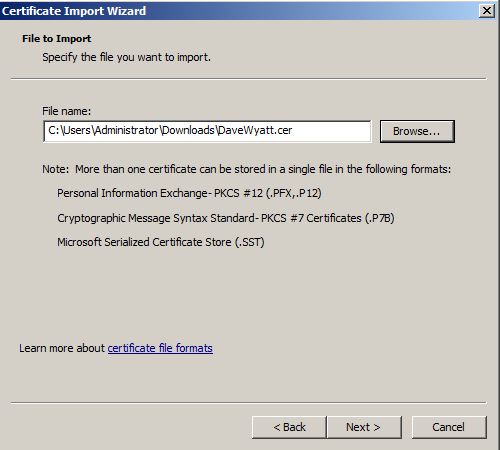

Figure 2.21: Selecting the user's certificate.

Ensure that the certificate is placed into the Trusted People store:

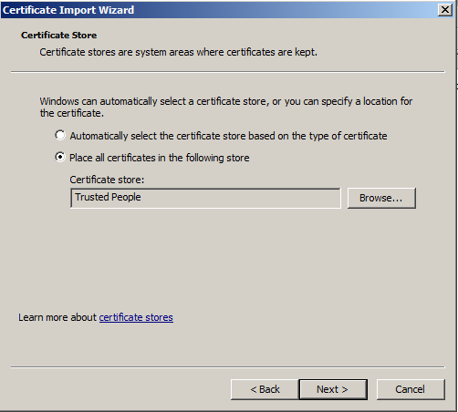

Figure 2.22: Placing the certificate into the Trusted People store.

#### Creating a Client Certificate mapping on the remote computer

Open a PowerShell console as Administrator on the remote computer. For this next step, you will require the Certificate Thumbprint of the CA that issued the client's certificate. You should be able to find this by issuing one of the following two commands \(depending on whether the CA's certificate is located in the "Trusted Root Certification Authorities" or the "Intermediate Certification Authorities" store\):

```
Get-ChildItem -Path cert:\LocalMachine\Root  
Get-ChildItem -Path cert:\LocalMachine\CA
```

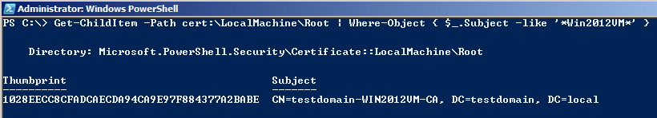

Figure 2.23: Obtaining the CA certificate thumbprint.

Once you have the thumbprint, issue the following command to create the certificate mapping:

```
New-Item -Path WSMan:\localhost\ClientCertificate -Credential (Get-Credential) -Subject <userPrincipalName> -URI \* -Issuer <CA Thumbprint> -Force
```

When prompted for credentials, enter the username and password of a local account with Administrator rights.

**Note:** It is not possible to specify the credentials of a domain account for certificate mapping, even if the remote computer is a member of a domain. You must use a local account, and the account must be a member of the Administrators group.

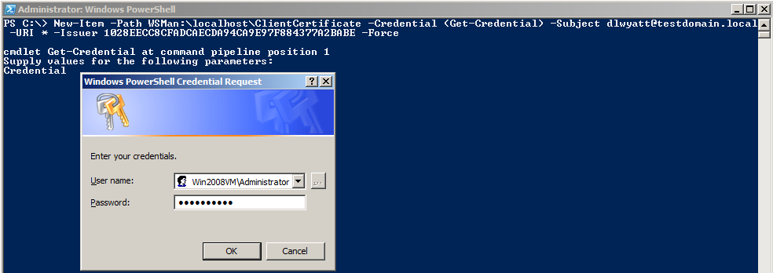

Figure 2.24: Setting up the client certificate mapping.

#### Connecting to the remote computer using Certificate Authentication

Now, you should be all set to authenticate to the remote computer using your certificate. For this step, you will need the thumbprint of the client authentication certificate. To obtain this, you can run the following command on the client computer:

```
Get-ChildItem -Path Cert:\CurrentUser\My
```

Once you have this thumbprint, you can authenticate to the remote computer by using either the Invoke-Command or New-PSSession cmdlets with the -CertificateThumbprint parameter, as shown in figure 2.25.

**Note:** The Enter-PSSession cmdlet does not appear to work with the -CertificateThumbprint parameter. If you want to enter an interactive remoting session with certificate authentication, use New-PSSession first, and then Enter-PSSession.

**Note:** The -UseSSL switch is implied when you use -CertificateThumbprint in either of these commands. Even if you don't type -UseSSL, you're still connecting to the remote computer over HTTPS \(port 5986, by default, on Windows 7 / 2008 R2 or later\). Figure 2.26 demonstrates this.

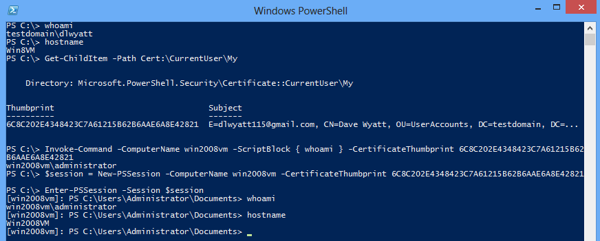

Figure 2.25: Using a certificate to authenticate with PowerShell Remoting.

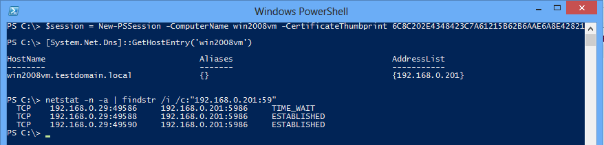

Figure 2.26: Demonstrating that the connection is over SSL port 5986, even without the -UseSSL switch.

## Modifying the TrustedHosts List

As I mentioned earlier, using SSL is only one option for connecting to a computer for which mutual authentication isn't possible. The other option is to selectively disable the need for mutual authentication by providing your computer with a list of "trusted hosts." In other words, you're telling your computer, "If I try to access SERVER1 \[for example\], don't bother mutually authenticating. I know that SERVER1 can't possibly be spoofed or impersonated, so I'm taking that burden off of your shoulders."

Figure 2.27 illustrates the connection we'll be attempting.

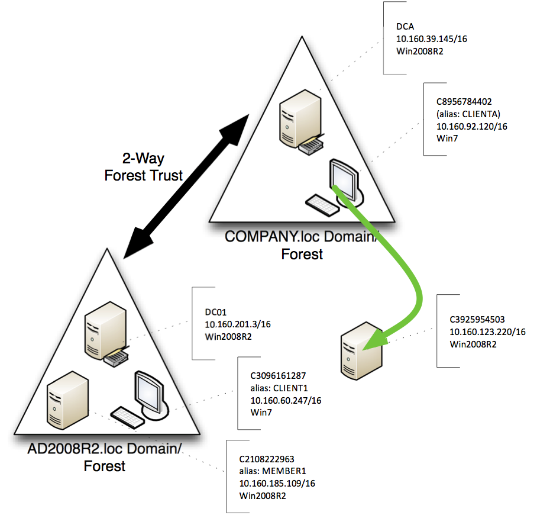

Figure 2.27: The TrustedHosts connection test

Beginning on CLIENTA, with a completely default Remoting configuration, we'll attempt to connect to C3925954503, which also has a completely default Remoting configuration. Figure 2.28 shows the result. Note that I'm connecting via IP address, rather than hostname; our client has no way of resolving the computer's name to an IP address, and for this test we'd rather not modify my local HOSTS file.

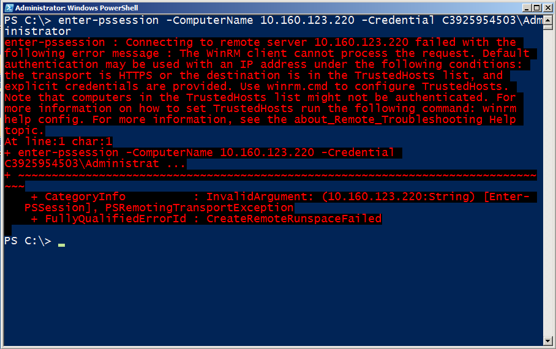

Figure 2.28: Attempting to connect to the remote computer

This is what we expected: The error message is clear that we can't use an IP address \(or a host name for a non-domain computer, although the error doesn't say so\) unless we either use HTTPS and a credential, or add the computer to my TrustedHosts list and use a credential. We'll choose the latter this time; figure 2.29 shows the command we need to run. If we'd wanted to connect via the computer's name \(C3925954503\) instead of its IP address, we'd have added that computer name to the TrustedHosts list \(It'd be our responsibility to ensure my computer could somehow resolve that computer name to an IP address to make the physical connection\).

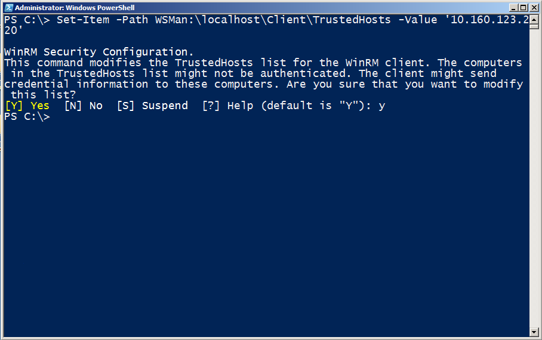

Figure 2.29: Adding the remote machine to our TrustedHosts list

This is another case where many blogs will advise just putting "\*" in the TrustedHosts list. Really? There's no chance any computer, ever, anywhere, could be impersonated or spoofed? We prefer adding a limited, controlled set of host names or IP addresses. Use a comma-separated list; it's okay to use wildcards along with some other characters \(like a domain name, such as \*.COMPANY.loc\), to allow a wide, but not unlimited, range of hosts. Figure 2.30 shows the successful connection.

**Tip:** Use the -Concatenate parameter of Set-Item to add your new value to any existing ones, rather than overwriting them.

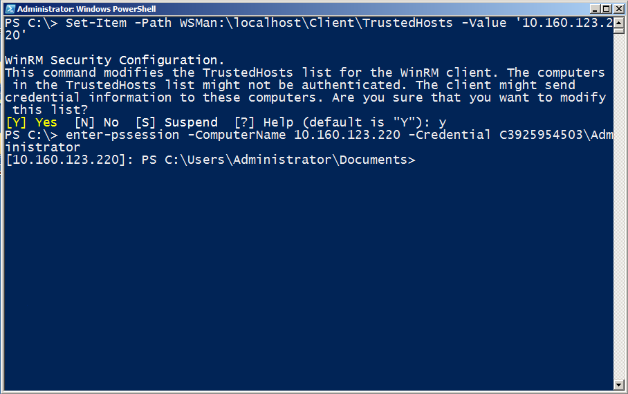

Figure 2.30: Connecting to the remote computer

Managing the TrustedHosts list is probably the easiest way to connect to a computer that can't offer mutual authentication, provided you're absolutely certain that spoofing or impersonation isn't a possibility. On an intranet, for example, where you already exercise good security practices, impersonation may be a remote chance, and you can add an IP address range or host name range using wildcards.

## Connecting Across Domains

Figure 2.31 illustrates the next connection we'll try to make, which is between two computers in different, trusted and trusting, forests.

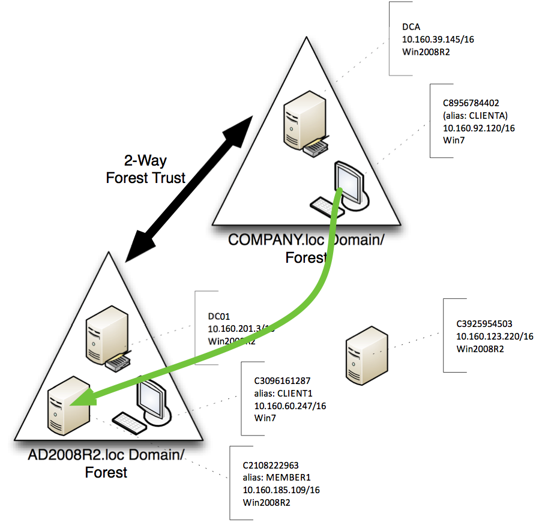

Figure 2.31: Connection for the cross-domain test

Our first test is in figure 2.32. Notice that we're creating a reusable credential in the variable $cred, so that we don't keep having to re-type the password as we try this. However, the results of the Remoting test still aren't successful.

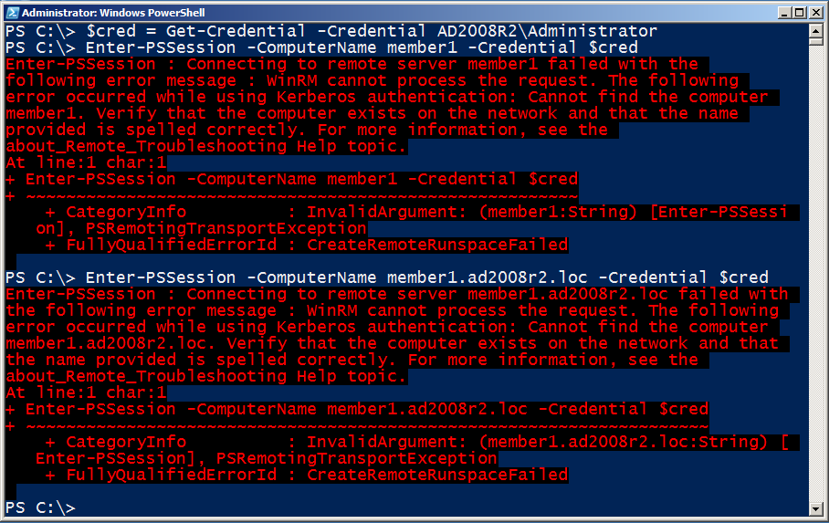

Figure 2.32: Attempting to connect to the remote computer

The problem? We're using a CNAME alias \(MEMBER1\), not the computer's real host name \(C2108222963\). While WinRM can use a CNAME to resolve a name to an IP address for the physical connection, it can't use the CNAME alias to look the computer up in AD, because AD doesn't use the CNAME record \(even in an AD-integrated DNS zone\). As shown in figure 2.33, the solution is to use the computer's real host name.

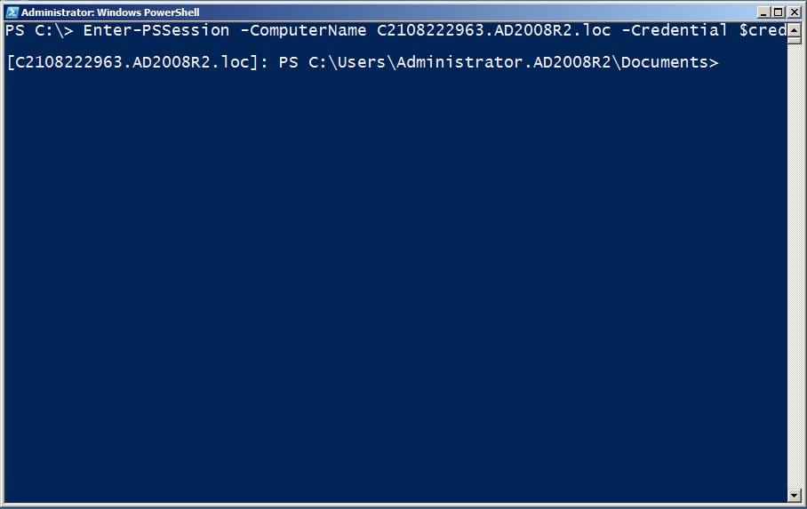

Figure 2.33: Successfully connecting across domains

What if you _need_ to use an IP address or CNAME alias to connect? Then you'll have to fall back to the TrustedHosts list or an HTTPS listener, exactly as if you were connecting to a non-domain computer. Essentially, if you can't use the computer's real host name, as listed in AD, then you can't rely on the domain to shortcut the whole authentication process.

## Administrators from Other Domains

There's a quirk in Windows that tends to strip the Administrator account token for administrator accounts coming in from other domains, meaning they end up running under standard user privileges - which often isn't sufficient. In the target domain, you need to change that behavior.

To do so, run this on the target computer \(type this all in one line and then hit Enter\):

```
New-ItemProperty -Name LocalAccountTokenFilterPolicy
-Path HKLM:\SOFTWARE\Microsoft\Windows\CurrentVersion\
Policies\System -PropertyType Dword -Value 1
```

That should fix the problem. Note that this does disable User Account Control \(UAC\) on the machine where you ran it, so make sure that's okay with you before doing so.

## The Second Hop

One default limitation with Remoting is often referred to as the second hop. Figure 2.25 illustrates the basic problem: You can make a Remoting connection from one host to another \(the green line\), but going from that second host to a third \(the red line\) is simply disallowed. This "second hop" doesn't work because, by default, Remoting can't delegate your credential a second time. This is even a problem if you make the first hop and subsequently try to access any network resource that requires authentication. For example, if you remote into another computer, and then ask that computer to access something on an authenticated file share, the operation fails.

### The CredSSP Solution

The following configuration changes are needed to enable the second hop:

**Note:** This only works on Windows Vista, Windows Server 2008, and later versions of Windows. It won't work on Windows XP or Windows Server 2003 or earlier versions.

* CredSSP must be enabled on your originating computer and the intermediate server you connect to. In PowerShell, on your originating computer, run:

```
Set-Item WSMAN:\localhost\client\auth\credssp -value $true
```

* On your intermediate server\(s\), you make a similar change to the above, but in a different section of the configuration:

```
Set-Item WSMAN:\localhost\service\auth\credssp -value $true
```

* Your domain policy must permit delegation of fresh credentials. In a Group Policy object \(GPO\), this is found in Computer Configuration &gt; Policies &gt; Administrative Templates &gt; System &gt; Credential Delegation &gt; Allow Delegation of Fresh Credentials. You must provide the names of the machines to which credentials may be delegated, or specify a wildcard like "\*.ad2008r2.loc" to allow an entire domain. Be sure to allow time for the updated GPO to apply, or run Gpupdate on the originating computer \(or reboot it\).

**Note:** Once again, the name you provide here is important. Whatever you'll actually be typing for the -computerName parameter is what must appear here. This makes it really tough to delegate credentials to, say, IP addresses, without just adding "\*" as an allowed delegate. Adding "\*," of course, means you can delegate to ANY computer, which is potentially dangerous, as it makes it easier for an attacker to impersonate a machine and get hold of your super-privileged Domain Admin account!

* When running a Remoting command, you must specify the "-Authentication CredSSP" parameter. You must also use the -Credential parameter and supply a valid DOMAIN\Username \(you'll be prompted for the password\) - even if it's the same username that you used to open PowerShell in the first place.

After setting the above, we were able to use Enter-PSSession to go from our domain controller to my member server, and then use Invoke-Command to run a command on a client computer - the connection illustrated in figure 2.34.

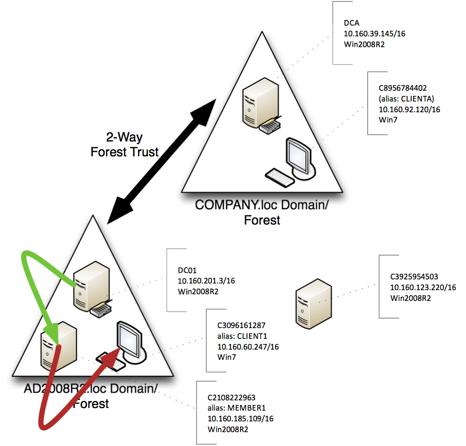

Figure 2.34: The connections for the second-hop test

Seem tedious and time-consuming to make all of those changes? There's a faster way. On the originating computer, run this:

```
Enable-WSManCredSSP -Role Client -Delegate name
```

Where "name" is the name of the computers that you plan to remote to next. This can be a wildcard, like \*, or a partial wildcard, like \*.AD2008R2.loc. Then, on the intermediate computer \(the one to which you will delegate your credentials\), run this:

```
Enable-WSManCredSSP -Role Server
```

Between them, these two commands will accomplish almost all of the configuration points we listed earlier. The only exception is that they will modify your local policy to permit fresh credential delegation, rather than modifying domain policy via a GPO. You can choose to modify the domain policy yourself, using the GPMC, to make that particular setting more universal.

### The Kerberos Solution

CredSSP isn't considered the safest protocol in the world \(see https://msdn.microsoft.com/en-us/library/cc226796.aspx\). Credentials _are_ transmitted, for example, and in clear text too, which is a problem. Fortunately, _within a domain, _there's another way to enable multi-hop Remoting, using the native Kerberos protocol, which does _not_ transmit credentials. Specifically, it's called Resource-Based Kerberos constraint delegation, and Microsoft PFE Ashley McGlone \(@goateePFE\) [wrote about it](https://blogs.technet.microsoft.com/ashleymcglone/2016/08/30/powershell-remoting-kerberos-double-hop-solved-securely/). 

This basic technique works since Windows Server 2003, so it should cover any situations you need. The idea here is that one machine can be allowed to delegate credentials _specific services on another machine. _Windows Server 2012 simplified the design of this previously undocumented, complex technique, and so we'll focus on that. So, every machine involved needs to have Windows Server 2012 or later, including at least one Win2012 domain controller in the domain. You'll also need a late-model Windows computer with the RSAT installed \(I used Windows 10\). You'll know you've got the run version if you can run:

```
Import-Module ActiveDirectory
Get-Command -ParameterName PrincipalsAllowedToDelegateToAccount
```

And get some results back. If you get nothing, you've got an older version of the RSAT - you need a newer one, which will likely require a newer version of Windows on your client. So, let's say we're on ClientA, we want to connect to ServerB, and have it delegate a credential across a second hop to ServerC.

```
$ClientA = $env:COMPUTERNAME
$ServerB = Get-ADComputer -Identity ServerB
$ServerC = Get-ADComputer -Identity ServerC

Set-ADComputer -Identity $ServerC -PrincipalsAllowedToDelegateToAccount $ServerB
```

This allows ServerC to accept a delegated credential from ServerB. That ability it an attribute of ServerC, if you're paying attention, meaning the _computer at the end of the second hop_ is what you modify, so that it can receive a credential from the middleman. Additionally, if you've already attempted a second-hop before setting this up, you need to wit about 15 minutes for Active Directory's "bad computer cache" to expire and allow all this to actually work. You could also just reboot ServerB, if you're in a lab or something and that's an option.

The -PrincipalsAllowedToDelegateToAccount can also be an array, as in @\($ServerB,$ServerZ,$ServerX\), etc, allowing multiple origins to delegate a credential to the machine account you're updating. And you can make this work across trust boundaries, too - see Ashley's original article for the technique.

