# Diagnostics and Troubleshooting
Troubleshooting and diagnosing Remoting can be one of the most difficult tasks an administrator has to deal with. When Remoting works, it works; when it doesn't, it's often hard to tell why. Fortunately, PowerShell v3 and its accompanying implementation of Remoting have much clearer and more prescriptive error messages than prior versions did. However, even v2 included an undocumented and little-appreciated module named PSDiagnostics, which is designed specifically to facilitate Remoting troubleshooting. Essentially, the module lets you turn on detailed trace log information before you attempt to initiate a Remoting connection. You can then utilize that detailed log information to get a better idea of where Remoting is failing.

## Diagnostics Examples

For the following scenarios, we started by importing the PSDiagnostics module (note that this is implemented as a script module, and requires an execution policy that permits it to run, such as RemoteSigned or Unrestricted). Figure 4.1 also shows that we ran the Enable-PSWSManCombinedTrace command, which starts the extended diagnostics logging.


Figure 4.1: Loading the diagnostics module and starting a trace

For each scenario, we then ran one or more commands that involved Remoting, as demonstrated in figure 4.2. We then disabled the trace by running Disable-PSWSManCombinedTrace, so that the log would only contain the details from that particular attempt (we cleared the log between attempts, so that each scenario provided a fresh diagnostics log).

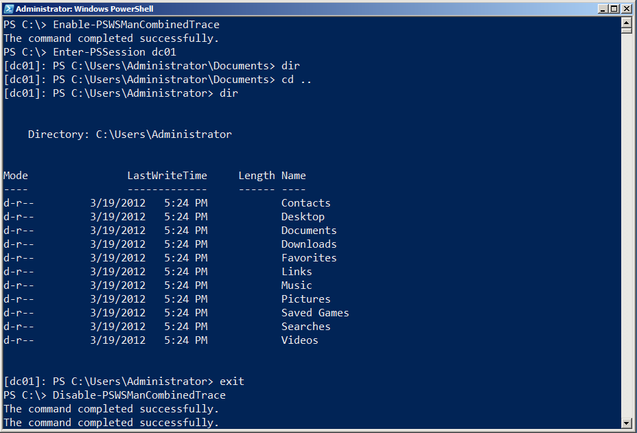

Figure 4.2: Entering a session and running a command

Finally, as shown in figure 4.3, we retrieved the messages from the log. In the scenarios that follow, we'll provide an annotated version of these. Note that we'll typically truncate much of this output so that we can focus on the most meaningful pieces. Also note that there's a bit of a difference in reading the information from the event log architecture, as we're doing in figure 4.3, and reading the .EVT trace file directly, as we'll do in some of our scenarios. The latter will provide combined information from different logs, which can sometimes be more useful.

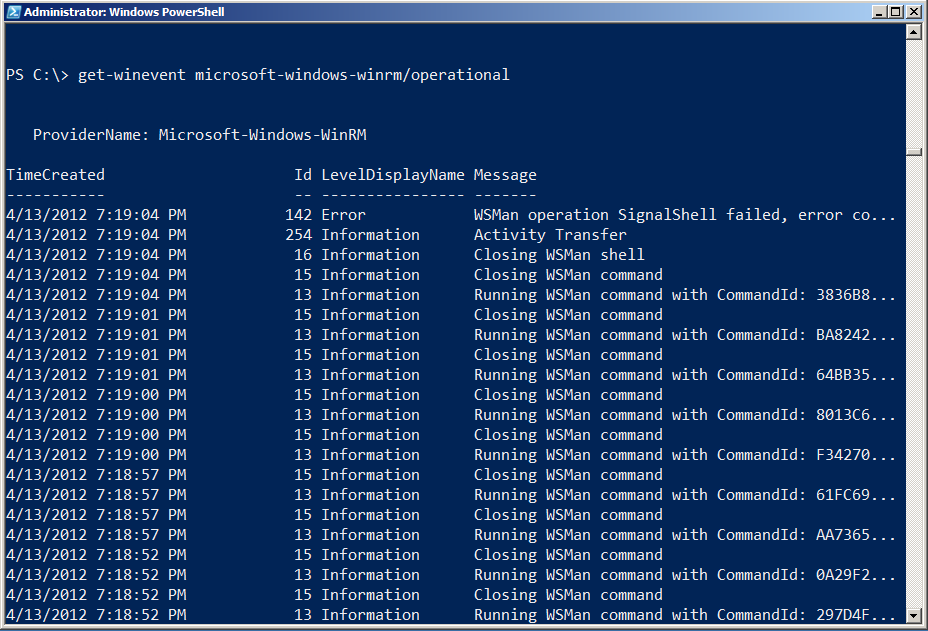

Figure 4.3: Examining the logged diagnostic information

We're also going to be making use of the Microsoft-Windows-WinRM/analytic log, which does not normally contain human-readable information. In order to utilize the log's contents, we'll use an internal Microsoft utility (which we've been given permission to distribute; you'll find it on the Downloads page at http://ConcentratedTech.com) to translate the log's contents into something we can read.

Trace information is stored in PowerShell's installation folder (run cd $pshome to get there, then change to the Traces folder). The filename extension is .ETL, and you can use Get-WinEvent -path filename.etl to read a particular file. The Construct-PSRemoteDataObject command, included in the ZIP file we referenced, can translate portions of the Analytic log's Message property into human-readable text. A demo script included in the ZIP file shows how to use it. As shown in figure 4.4, we dot-sourced the Construct-PSRemoteDataObject.ps1 file into our shell in order to gain access to the commands it contains.

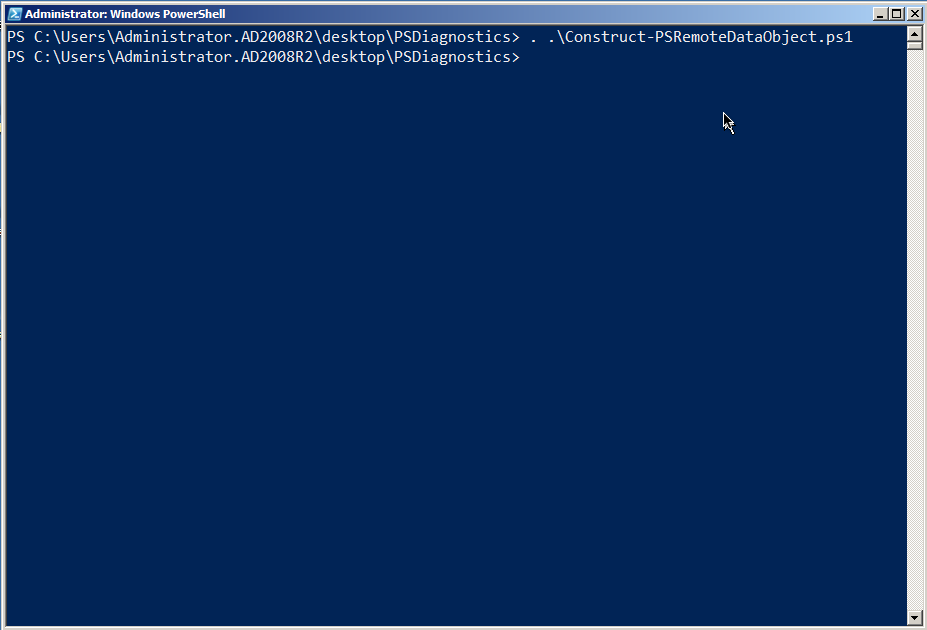

Figure 4.4 Dot-sourcing the Construct-PSRemoteDataObject.ps1 script

We also deleted the contents of C:\Windows\System32\WindowsPowerShell\v1.0\Traces prior to starting each of the following examples.

#### A Perfect Remoting Connection

For this connection, we went from the Windows 7 client computer in the AD2008R2 domain to the DC01 domain controller. On the DC, we changed to the C:\ folder, ran a directory, and then ended the session. Figure 4.5 shows the entire scenario.

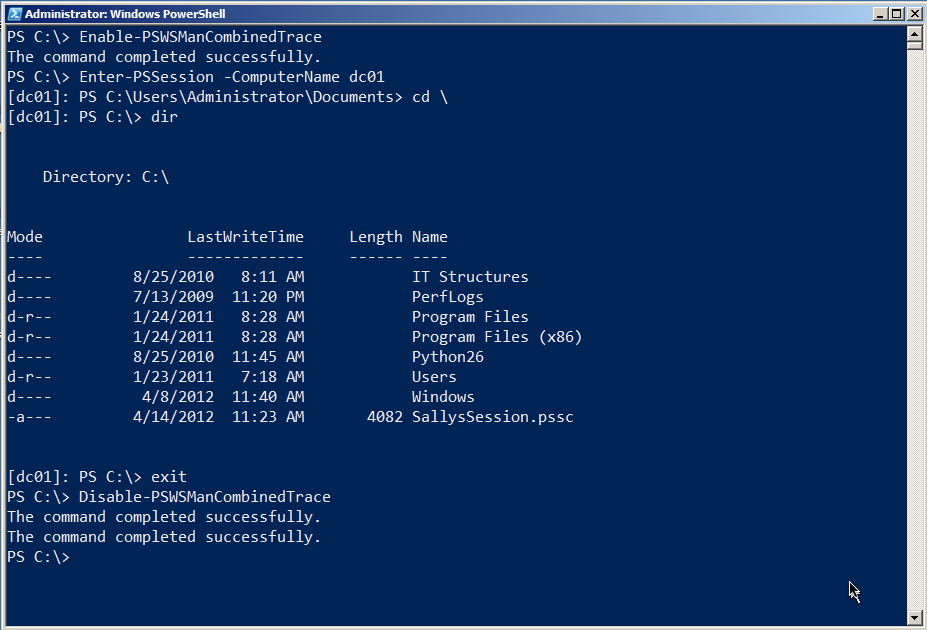

Figure 4.5: The example for this scenario

We then read the log in chronological order. You need to be a bit careful; running Enable-PSWSManCombinedTrace and Disable-PSWSManCombined trace actually create log events themselves. We'll often run the Enable command, and then wait a few minutes to actually do anything with Remoting. That way, we can tell by the timestamp in the log when the "real" traffic began. We'll wait a few more minutes before running the Disable command, again so that we can easily tell when the "real" log traffic ended. Also note that we'll be getting information from two logs, WinRM and PowerShell, although reading the .ETL file with Get-WinEvent will grab everything in sequence.

**Note:** We've experienced problems using Get-WinEvent in PowerShell v3 on non-US English machines. If you run into problems, consider running the command from PowerShell v2, or use the GUI Event Viewer application to view the event log.

The connection begins with (in this example) Enter-PSSession and name resolution, as shown in figure 4.6.

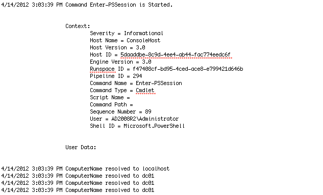

Figure 4.6: Starting the Remoting connection

WinRM has to spin up a runspace (essentially, a PowerShell process) on the remote computer. That includes setting several options for locale, timing, and so on, as shown in figure 4.7.

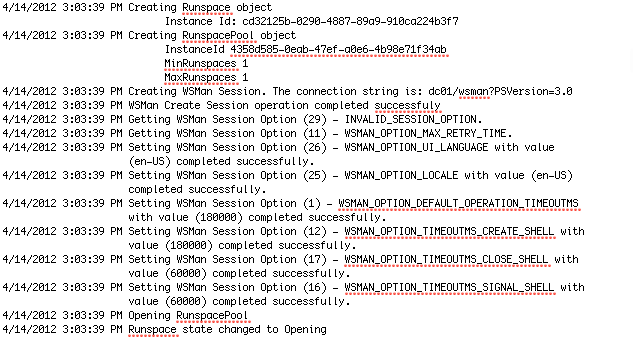

Figure 4.7: Starting the remote runspace

This will go on for a while. Eventually, you'll see WinRM beginning to send "chunks," which are packetized communications. These are sent via the Simple Object Access Protocol, so expect to see "SOAP" referenced a lot (WS-MAN is a Web service, remember, and SOAP is the communications language of Web services). Figure 4.8 shows a couple of these 1500-byte chunks. Notice that the actual payload is pretty much gibberish.

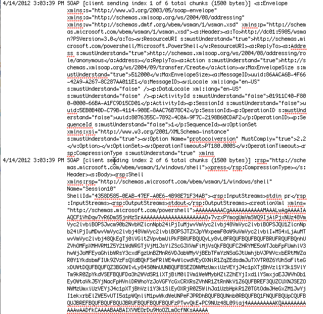

Figure 4.8: Data begins to transfer over the connection

This gibberish is what the Construct-PSRemoteDataObject command can translate. For example, those "sending" messages have an event ID of 32868; by looking for just those events we can see what's being sent, as shown in figure 4.9.

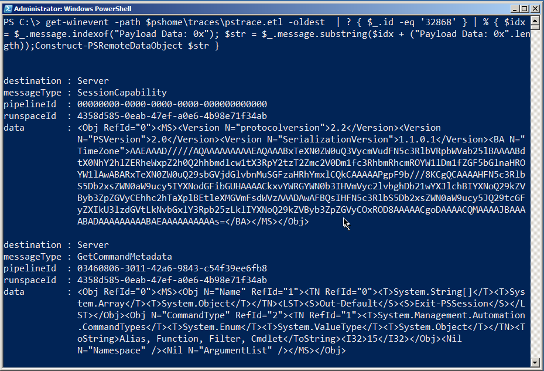

Figure 4.9: Translating the data that was sent

In this case, the client was asking the server (which is listed as the destination) about its capabilities, and for some metadata on the Exit-PSSession command (that's the second message). This is how the client figures out what kind of server it's talking to, and other important, preliminary information. Now, the client knows what version of the serialization protocol will be used to send data back and forth, what time zone the server is in, and other details.

**Note:** Event ID 32868 is client-to-server traffic; ID 32867 represents server-to-client traffic. Using those two IDs along with Construct-PSRemoteDataObject can reveal the majority of the session transcript once the connection is established.

Moving on. As shown in figure 4.10, you'll then see some authentication back-and-forth, during which some errors can be expected. The system will eventually get over it and, as shown, start receiving chunks of data from the server.

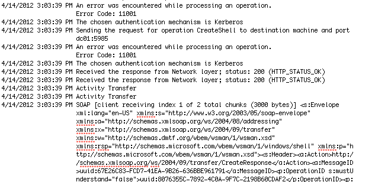

Figure 4.10: Getting authentication taken care of

A rather surprising amount of back-and-forth can ensue as the two computers exchange pleasantries, share information about each other and how they work, and so on. We're going to switch our event log output, now, to include event ID numbers, because those can be pretty useful when trying to grab specific pieces of data. At this point, the log will mainly consist of the client sending commands and the server sending back the results. This is more readable when you use Construct-PSRemoteDataObject, so here's the complete back-and-forth from that perspective: First up is the client's statement of its session capabilities:

````
destination : Server
messageType : SessionCapability
pipelineId : 00000000-0000-0000-0000-000000000000
runspaceId : 4358d585-0eab-47ef-a0e6-4b98e71f34ab
data    : <Obj RefId="0"><MS><Version
       N="protocolversion">2.2</Version><Version
       N="PSVersion">2.0</Version><Version
       N="SerializationVersion">1.1.0.1</Version><BA N="TimeZon
       e">AAEAAAD/////AQAAAAAAAAAEAQAAABxTeXN0ZW0uQ3VycmVudFN5c
       3RlbVRpbWVab25lBAAAABdtX0NhY2hlZERheWxpZ2h0Q2hhbmdlcw1tX
       3RpY2tzT2Zmc2V0Dm1fc3RhbmRhcmROYW1lDm1fZGF5bGlnaHROYW1lA
       wABARxTeXN0ZW0uQ29sbGVjdGlvbnMuSGFzaHRhYmxlCQkCAAAAAPgpF
       9b///8KCgQCAAAAHFN5c3RlbS5Db2xsZWN0aW9ucy5IYXNodGFibGUHA
       AAACkxvYWRGYWN0b3IHVmVyc2lvbghDb21wYXJlchBIYXNoQ29kZVByb
       3ZpZGVyCEhhc2hTaXplBEtleXMGVmFsdWVzAAADAwAFBQsIHFN5c3Rlb
       S5Db2xsZWN0aW9ucy5JQ29tcGFyZXIkU3lzdGVtLkNvbGxlY3Rpb25zL
       klIYXNoQ29kZVByb3ZpZGVyCOxROD8AAAAACgoDAAAACQMAAAAJBAAAA
       BADAAAAAAAAABAEAAAAAAAAAAs=</BA></MS></Obj>
````

Then the server's:

````
destination : Client
messageType : SessionCapability
pipelineId : 00000000-0000-0000-0000-000000000000
runspaceId : 00000000-0000-0000-0000-000000000000
data    : <Obj RefId="0"><MS><Version
       N="protocolversion">2.2</Version><Version
       N="PSVersion">2.0</Version><Version
       N="SerializationVersion">1.1.0.1</Version></MS></Obj>
````

Next is the server's $PSVersionTable object, which lists various versioning information:

````
destination : Client
messageType : ApplicationPrivateData
pipelineId : 00000000-0000-0000-0000-000000000000
runspaceId : 4358d585-0eab-47ef-a0e6-4b98e71f34ab
data    : <Obj RefId="0"><MS><Obj N="ApplicationPrivateData"
       RefId="1"><TN RefId="0"><T>System.Management.Automation.
       PSPrimitiveDictionary</T><T>System.Collections.Hashtable
       </T><T>System.Object</T></TN><DCT><En><S
       N="Key">PSVersionTable</S><Obj N="Value"
       RefId="2"><TNRef RefId="0" /><DCT><En><S
       N="Key">PSVersion</S><Version
       N="Value">2.0</Version></En><En><S
       N="Key">PSCompatibleVersions</S><Obj N="Value"
       RefId="3"><TN RefId="1"><T>System.Version[]</T><T>System
       .Array</T><T>System.Object</T></TN><LST><Version>1.0</Ve
       rsion><Version>2.0</Version><Version>3.0</Version></LST>
       </Obj></En><En><S N="Key">BuildVersion</S><Version
       N="Value">6.2.8314.0</Version></En><En><S
       N="Key">PSRemotingProtocolVersion</S><Version
       N="Value">2.2</Version></En><En><S
       N="Key">WSManStackVersion</S><Version
       N="Value">3.0</Version></En><En><S
       N="Key">CLRVersion</S><Version
       N="Value">4.0.30319.261</Version></En><En><S
       N="Key">SerializationVersion</S><Version N="Value">1.1.0
       .1</Version></En></DCT></Obj></En></DCT></Obj></MS></Obj
       >
````

Next the server sends information about the runspace that will be used:

````
destination : Client
messageType : RunspacePoolStateInfo
pipelineId : 00000000-0000-0000-0000-000000000000
runspaceId : 4358d585-0eab-47ef-a0e6-4b98e71f34ab
data    : <Obj RefId="0"><MS><I32
       N="RunspaceState">2</I32></MS></Obj>
````

The client sends information about its Exit-PSSession command:

````
destination : Server
messageType : GetCommandMetadata
pipelineId : 03460806-3011-42a6-9843-c54f39ee6fb8
runspaceId : 4358d585-0eab-47ef-a0e6-4b98e71f34ab
data    : <Obj RefId="0"><MS><Obj N="Name" RefId="1"><TN RefId="0"
       ><T>System.String[]</T><T>System.Array</T><T>System.Obje
       ct</T></TN><LST><S>Out-Default</S><S>Exit-PSSession</S><
       /LST></Obj><Obj N="CommandType" RefId="2"><TN RefId="1">
       <T>System.Management.Automation.CommandTypes</T><T>Syste
       m.Enum</T><T>System.ValueType</T><T>System.Object</T></T
       N><ToString>Alias, Function, Filter,
       Cmdlet</ToString><I32>15</I32></Obj><Nil N="Namespace"
       /><Nil N="ArgumentList" /></MS></Obj>
````

A bit later we'll see the result of the CD C:\ command, which is the new PowerShell prompt reflecting the new folder location:

````
destination : Client
messageType : PowerShellOutput
pipelineId : c913b8ae-2802-4454-9d9b-926ca6032018
runspaceId : 4358d585-0eab-47ef-a0e6-4b98e71f34ab
data    : <S>PS C:\&gt; </S>
````
Next we'll look at the output of the Dir command. This first bit is writing the column headers for Mode, LastWriteTime, Length, Name, and so forth. This is all being sent to our client - we'll just include the first few lines, each of which comes across in its own block:

````
destination : Client
messageType : RemoteHostCallUsingPowerShellHost
pipelineId : c259c891-516a-46a7-b287-27c96ff86d5b
runspaceId : 4358d585-0eab-47ef-a0e6-4b98e71f34ab
data    : <Obj RefId="0"><MS><I64 N="ci">-100</I64><Obj N="mi"
       RefId="1"><TN RefId="0"><T>System.Management.Automation.
       Remoting.RemoteHostMethodId</T><T>System.Enum</T><T>Syst
       em.ValueType</T><T>System.Object</T></TN><ToString>Write
       Line2</ToString><I32>16</I32></Obj><Obj N="mp"
       RefId="2"><TN RefId="1"><T>System.Collections.ArrayList<
       /T><T>System.Object</T></TN><LST><S>Mode        
       LastWriteTime   Length Name             
                  </S></LST></Obj></MS></Obj>
destination : Client
messageType : RemoteHostCallUsingPowerShellHost
pipelineId : c259c891-516a-46a7-b287-27c96ff86d5b
runspaceId : 4358d585-0eab-47ef-a0e6-4b98e71f34ab
data    : <Obj RefId="0"><MS><I64 N="ci">-100</I64><Obj N="mi"
       RefId="1"><TN RefId="0"><T>System.Management.Automation.
       Remoting.RemoteHostMethodId</T><T>System.Enum</T><T>Syst
       em.ValueType</T><T>System.Object</T></TN><ToString>Write
       Line2</ToString><I32>16</I32></Obj><Obj N="mp"
       RefId="2"><TN RefId="1"><T>System.Collections.ArrayList<
       /T><T>System.Object</T></TN><LST><S>----        
       -------------   ------ ----             
                  </S></LST></Obj></MS></Obj>
destination : Client
messageType : RemoteHostCallUsingPowerShellHost
pipelineId : c259c891-516a-46a7-b287-27c96ff86d5b
runspaceId : 4358d585-0eab-47ef-a0e6-4b98e71f34ab
data    : <Obj RefId="0"><MS><I64 N="ci">-100</I64><Obj N="mi"
       RefId="1"><TN RefId="0"><T>System.Management.Automation.
       Remoting.RemoteHostMethodId</T><T>System.Enum</T><T>Syst
       em.ValueType</T><T>System.Object</T></TN><ToString>Write
       Line2</ToString><I32>16</I32></Obj><Obj N="mp"
       RefId="2"><TN RefId="1"><T>System.Collections.ArrayList<
       /T><T>System.Object</T></TN><LST><S>d----    
       8/25/2010  8:11 AM      IT Structures      
                     </S></LST></Obj></MS></Obj>
destination : Client
messageType : RemoteHostCallUsingPowerShellHost
pipelineId : c259c891-516a-46a7-b287-27c96ff86d5b
runspaceId : 4358d585-0eab-47ef-a0e6-4b98e71f34ab
data    : <Obj RefId="0"><MS><I64 N="ci">-100</I64><Obj N="mi"
       RefId="1"><TN RefId="0"><T>System.Management.Automation.
       Remoting.RemoteHostMethodId</T><T>System.Enum</T><T>Syst
       em.ValueType</T><T>System.Object</T></TN><ToString>Write
       Line2</ToString><I32>16</I32></Obj><Obj N="mp"
       RefId="2"><TN RefId="1"><T>System.Collections.ArrayList<
       /T><T>System.Object</T></TN><LST><S>d----    
       7/13/2009 11:20 PM      PerfLogs        
                     </S></LST></Obj></MS></Obj>
````

Eventually the command finishes and we get the prompt again:

````
destination : Client
messageType : PowerShellOutput
pipelineId : f5c8bc7a-ec54-4180-b2d4-86479f9ea4b9
runspaceId : 4358d585-0eab-47ef-a0e6-4b98e71f34ab
data    : <S>PS C:\&gt; </S>
````
You'll also see periodic exchanges about the state of the pipeline - this indicates that the command is done:

````
destination : Client
messageType : PowerShellStateInfo
pipelineId : f5c8bc7a-ec54-4180-b2d4-86479f9ea4b9
runspaceId : 4358d585-0eab-47ef-a0e6-4b98e71f34ab
data    : <Obj RefId="0"><MS><I32
       N="PipelineState">4</I32></MS></Obj>
````

There's definitely a lot of data passing back and forth - but it's possible to make sense of it using these tools. Frankly, most Remoting problems take place during the connection phase, meaning once that's completed successfully you have no further problems. So in the next scenarios, we'll focus on specific connection errors.

**Note:** To clear the log and prepare for a new trace, we usually delete the .ETL files and go into Event Viewer to clear the Applications and Services Logs > Microsoft > Windows > Windows Remote Management log. If you're getting errors when running Enable-PSWSManCombinedTrace, one of those two tasks probably hasn't been completed.

#### Connection Problem: Blocked Port

Figure 4.11 shows what happens when you try to connect to a computer and the necessary port - 5985 by default - isn't open all the way through. We're going to look at how this appears in the log. Note that we're assuming you've already checked the computer name, made sure it resolves to the proper IP address, and so forth; what you're looking at is definitely a blocked port (because we set it up that way) in this example.

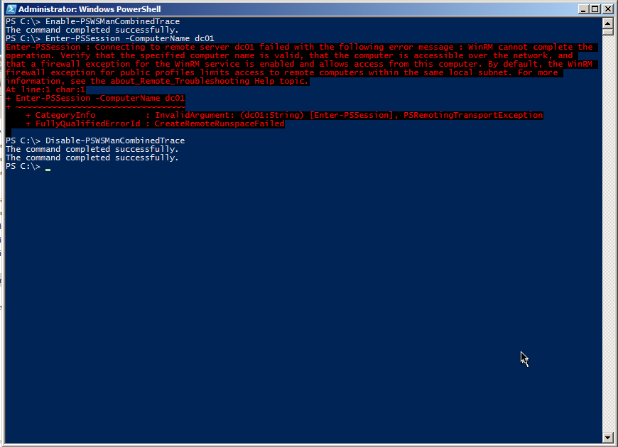

Figure 4.11: Connection failure due to a firewall or other port-blocking problem.

Figure 4.12 shows that we successfully resolved the computer name. We find that testing with Enter-PSSession is easiest, because it's really easy to spot that command in the log and see when the "real" log data begins.

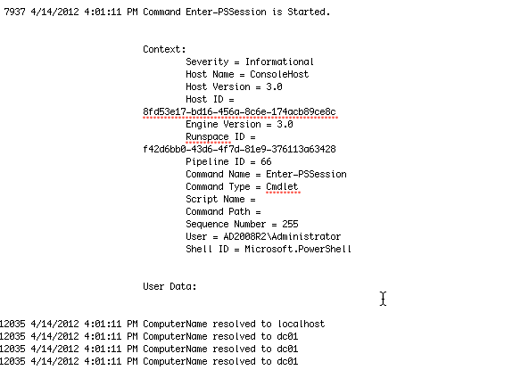

Figure 4.12: Starting the connection attempt

Note that a lot of the initial log traffic is still WinRM talking to itself, getting set up for the actual connection attempt. Just keep scrolling through that until you start to see problem indications. Figure 4.13 shows a timeout - never a good sign - and the error message generated by WinRM. As you can see, this is exactly what we got on-screen, so PowerShell isn't hiding anything from us.


Figure 4.13: The timeout error in the diagnostics log

This is actually one of the trickiest bits of Remoting: It can't tell why the server didn't respond. It doesn't realize that the port isn't open. For all WinRM knows, we could have specified a computer name that doesn't exist. All it knows is that it sent a message out to the network, and nobody replied. In the end, nearly all of the possible "low level" problems - bad IP address, bad computer name, blocked port, and so forth all look the same from WinRM's point of view. You're on your own to troubleshoot these problems.

We've found that one useful technique can be to use the old command-line Telnet client. Keep in mind that WS-MAN is just HTTP, and HTTP - like many Internet protocols - is just sending text back and forth, more or less exactly like Telnet. HTTP has specific text it sends and looks for, but the actual transmission is old-school Telnet. So we'll run something like telnet dc01 5985 just to see if we can connect. A blank screen is normal: Hit Ctrl+C to break out, and you'll see an HTTP "Bad Request" error. That's fine - it means you got through. That confirms the computer name, the IP address, the port, and everything else "low-level."

#### Connection Problem: No Permissions

This can be a bit of a tricky problem, because you need to be an Administrator to enable a diagnostics trace. On the other hand, WinRM is usually quite clear when you can't connect because your account doesn't have permission to the endpoint: "Access Denied" is the error message, and that's pretty straightforward.

But you can also log on as an Administrator (or open a shell under Administrator credentials), enable a trace, and then have the other user (or your other user account) try whatever it is they're trying. Go back in as Administrator and disable the trace, then examine the log. Figure 4.14 shows what you're looking for.

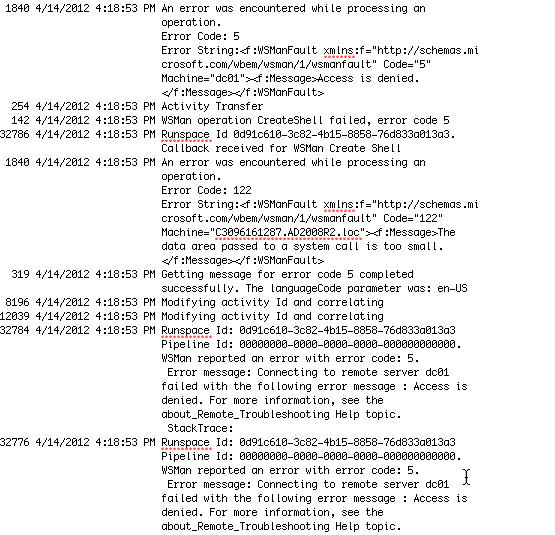

Figure 4.14: "Access Denied" in the diagnostics log

The log data just after that will show you the user account that was used to try and create the connection (AD2008R2\SallyS, in our example, which is why the command failed - she's not an Administrator). A quick check with Get-PSSessionConfiguration on the remote machine will confirm the permissions on whatever Remoting endpoint you're attempting to connect to. Also, as shown in figure 4.15, we've found that running Set-PSSessionConfiguration can be useful. Provide the -Name of the endpoint you're checking, and add -ShowSecurityDescriptorUI. That will let you confirm the endpoint's permissions in a friendlier GUI form - and you can modify it right there if need be.

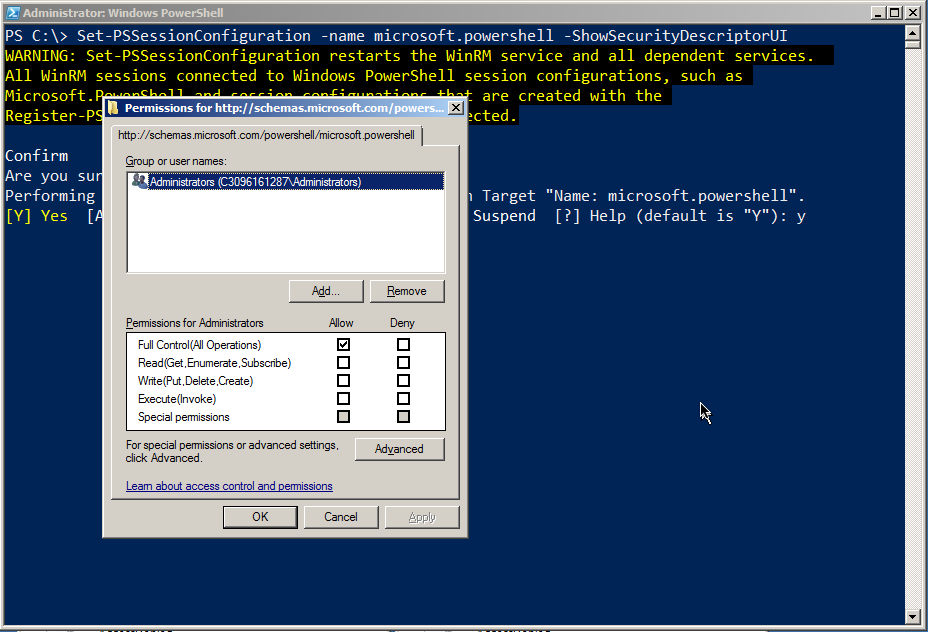

Figure 4.15: Checking an endpoint's permissions using Set-PSSessionConfiguration

#### Connection Problem: Untrusted Host

Figure 4-16 shows the connection we're trying to make: From the client in the AD2008R2 domain to a standalone computer that isn't part of a domain.

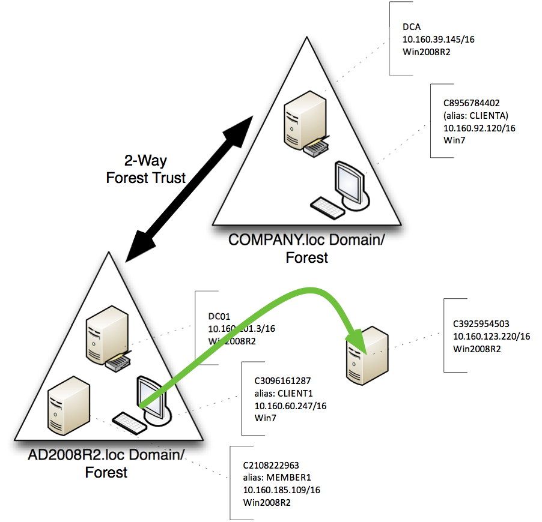

Figure 4.16: Attempted connection for this scenario

As shown in figure 4.17, the error comes quickly, even though we've provided a valid credential. The problem is that we're in a situation where WinRM can't get the mutual authentication it wants; part 2 of this guide covers solutions for fixing the problem. But what does the problem look like in the diagnostics log?

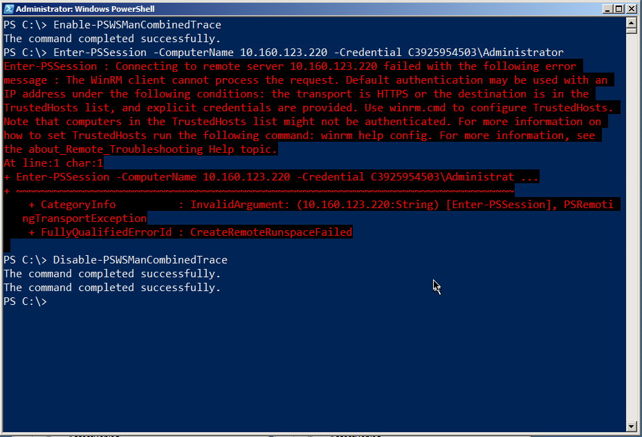

Figure 4.17: The error message gives good clues as to how to solve this problem

Figure 4.18 shows that WinRM still sends its initial salvo of traffic to the server. It's when the reply comes back that the client realizes it can't authenticate this server, and the error is generated. What you see in the log is pretty much what shows up in the shell, verbatim.

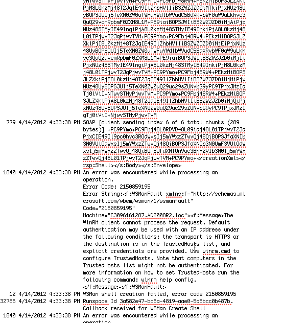

Figure 4.18: The diagnostic log content when attempting to connect to an untrusted host

Figure 4.19 shows a good second step to take: Run Test-WSMan. Provide the same computer name or IP address, but leave off the -Credential parameter. The cmdlet can at least tell you that WS-MAN and WinRM are up and running on the remote computer, and what version they're running. That at least narrows the problem down to one of authentication: Either your permissions (which would have resulted in an "Access Denied") or the mutual authentication component of Remoting.

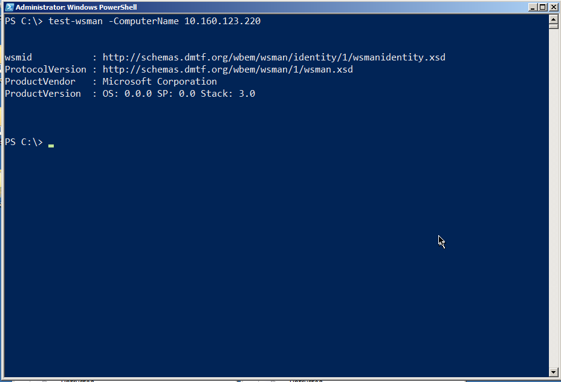

Figure 4.19: Test-WSMan is kind of like a "ping" for Remoting

**Note:** You'll see substantially the same behavior when you attempt to connect using HTTPS (the -UseSSL switch on the various Remoting commands), and the remote machine's SSL certificate name doesn't match the name you used in your command. The error message is unambiguous both on-screen and in the log, and we discuss solutions in part 2 of the guide.

## Standard Troubleshooting Methodology

Troubleshooting can be difficult, especially with Remoting since there are so many layers in which something can go wrong. Following a straightforward, standardized approach can help pinpoint problems.

1. Test Remoting with its default configuration. If you've tinkered with that, undo your changes and start from scratch.
2. Start by attempting to connect from the initiating machine to the target machine by using something other than Remoting, but which is still security-sensitive. For example, use Windows Explorer to open the remote machine's C$ shared folder. If that doesn't work, you have broader security issues. Make a note of whether or not you need to provide alternate credentials - if you do, Remoting will need them as well.
3. Install a Telnet client on the initiating machine (a simple command-line client, like the Windows native one, will do). Attempt to connect to the HTTP WinRM listener by running telnet machine_name:5985. You should get a blank screen, and Ctrl+C will end the session. If this doesn't work, there's a basic connectivity problem (such as a blocked port) you need to resolve.
4. Use Test-WSMan as described earlier, using an alternate credential if necessary. Make sure you're either using the machine's real name as it appears in Active Directory, or that you've taken one of the other approaches (TrustedHosts plus a credential, or SSL plus a credential) that we outlined in Section 2 of this guide. If that doesn't work, you have a problem in the WS-MAN configuration.

Simply walking through these four steps, in this order, can help you pinpoint at least the general cause of most problems.

## Summary

So why did we bother going through the logs when, in most of our examples, the logs simply echoed what was on the screen? Simple: As PowerShell becomes embedded in more and more GUI applications, you might not always have a console, with its nice error messages, to rely upon. What you can do, however, is use the console to start a trace, run whatever GUI app is failing, and then dig into the log to see if you find some of the signs we've shown you here.


