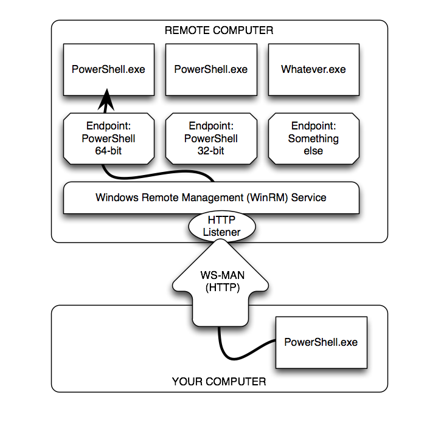
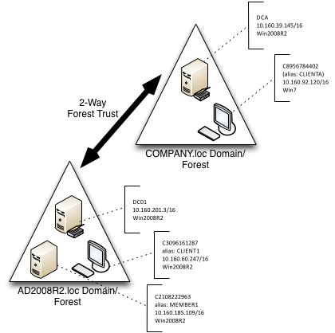
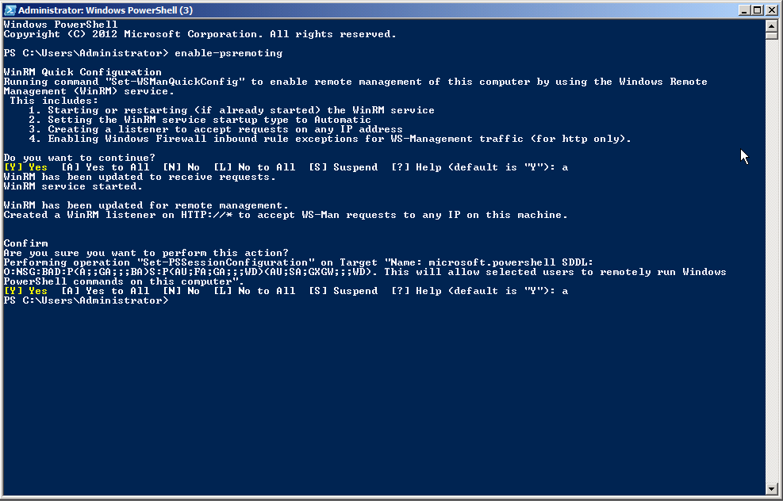
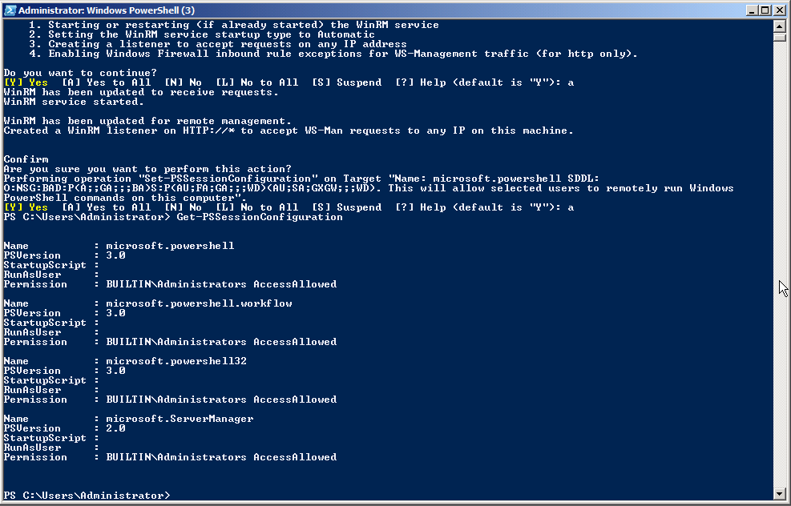
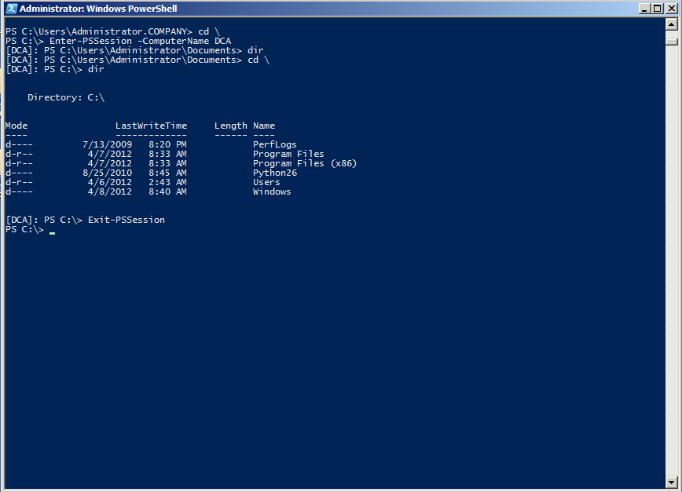

# Remoting Basics

Windows PowerShell 2.0 introduced a powerful new technology, Remoting, which was refined and expanded upon for PowerShell 3.0. Based primarily upon standardized protocols and techniques, Remoting is possibly one of the most important aspects of PowerShell: future Microsoft products will rely upon it almost entirely for administrative communications across a network.

Unfortunately, Remoting is also a complex set of components, and while Microsoft has attempted to provide solid guidance for using it in a variety of scenarios, many administrators still struggle with it. This "mini e-book" is designed to help you better understand what Remoting is, how it works, and-most importantly-how to use it in a variety of different situations.

**Note** This guide isn't meant to replace the myriad of existing books that cover Remoting basics, such as Don's own _Learn Windows PowerShell in a Month of Lunches_ ( [http://MoreLunches.com](http://MoreLunches.com)) or _PowerShell in Depth_. Instead, this guide supplements those by providing step-by-step instructions for many of the "edge" cases in Remoting, and by explaining some of the more unusual Remoting behaviors and requirements.

## What is Remoting?

In essence, Remoting enables you to access remote machines across a network and retrieve data from or execute code on one or many remote computers. This is not a new idea, and in the past a number of different remoting technologies have evolved. Some cmdlets have traditionally provided their own limited remoting capabilities while the majority of cmdlets do not support remoting on their own.

With PowerShell remoting there is finally a generic remoting environment that allows remote execution for literally any command that can run in a local PowerShell. So instead of adding remoting capabilities to every single cmdlet and application, you simply leave it to PowerShell to transfer your PowerShell code to the target computer(s), execute it there, and then marshal back the results to you.

Throughout this eBook, we will focus on PowerShell remoting and not cover non-standard private remoting capabilities built into selected cmdlets.

## Examining Remoting Architecture

As shown in figure 1.1, PowerShell's generic Remoting architecture consists of numerous different, interrelated components and elements.



Figure 1.1: The elements and components of PowerShell Remoting

Here is the complete list:

■    At the bottom of the figure is your computer, or more properly your client. This is where you physically sit, and it's where you'll initiate most of your Remoting activities. 

■    Your computer will communicate via the WS-MAN, or Web Services for Management, protocol. This is an HTTP(S)-based protocol that can encapsulate a variety of different communications. We've illustrated this as using HTTP, which is Remoting's default configuration, but it could just as easily be HTTPS.

■     On the remote computer, in the proper terminology the server (which does not refer to the operating system), the Windows Remote Management (WinRM) service runs. This service is configured to have one or more listeners. Each listener waits for incoming WS-MAN traffic on a specific port, each bound to a specific protocol (HTTP or HTTPS), and on specific IP addresses (or all local addresses).

■    When a listener receives traffic, the WinRM service looks to see which endpoint the traffic is meant for. For our purposes, an endpoint will usually be launching an instance of Windows PowerShell. In PowerShell terms, an endpoint is also called a session configuration. This is because, in addition to launching PowerShell, it can auto-load scripts and modules, place restrictions upon what can be done by the connecting user, and apply additional  session specific settings not mentioned here.

**Note** Although we show **PowerShell.exe** in our diagram, that's for illustration purposes. **PowerShell.exe** is the PowerShell console application, and it would not make sense to have this running as a background process on a remote computer. The actual process is called **Wsmprovhost.exe**, which hosts PowerShell in the background for Remoting connections.

As you can see, a single remote computer can easily have dozens or even hundreds of endpoints, each with a different configuration. PowerShell 3.0 sets up three such endpoints by default: One for 32-bit PowerShell (on 64-bit systems), the default PowerShell endpoint (which is 64-bit on x64 systems), and one for PowerShell Workflow. Beginning with Windows Server 2008 R2, there is a fourth default endpoint for Server Manager Workflow tasks.

## Enabling Remoting

Most client versions of Windows, beginning with Windows Vista, do not enable incoming Remoting connections by default. Newer Windows Server versions do, but older versions may not. So your first step with Remoting will usually be to enable it on those computers which you want to receive incoming connections. There are three ways to enable Remoting, and table 1.1 compares what is achievable with each of them.

Table 1.1 Comparing the ways of enabling remoting

|  | Enable-PSRemoting | Group Policy | Manually Step-by-Step |
| --- | --- | --- | --- |
| Set WinRM to auto-start and start the service | Yes | Yes | Yes - use **Set-Service** and **Start-Service**. |
| Configure HTTP listener | Yes | You can configure auto-registration of listeners, not create custom listeners | Yes - use WSMAN command-line utility and **WSMAN:** drive in PowerShell |
| Configure HTTPS listener | No | No | Yes - use WSMAN command-line utility and **WSMAN:** drive in PowerShell |
| Configure endpoints / session configurations | Yes | No | Yes - use PSSessionConfiguration cmdlets |
| Configure Windows Firewall exception | Yes\* | Yes\* | Yes\* - use Firewall cmdlets or Windows Firewall GUI |

**Note** Existing client versions of Windows, such as Windows Vista, do not permit firewall exceptions on any network identified as "Public". Networks must either be "Home" or "Work/Domain" in order to permit exceptions. In PowerShell 3.0, you can run **Enable-PSRemoting** with the **-SkipNetworkProfileCheck** switch to avoid this problem.

We'll be enabling Remoting in our test environment by running **Enable-PSRemoting**. It's quick, easy, and comprehensive; you'll also see most of the manual tasks performed in the upcoming sections.

## Test Environment

We'll be using a consistent test environment throughout the following sections; this was created on six virtual machines at _CloudShare.com_, and is configured as shown in figure 1.2.



Figure 1.2: Test environment configuration

Some important notes:

■    .NET Framework v4 and PowerShell 3.0 is installed on all computers. Most of what we'll cover also applies to PowerShell 2.0.

■    As shown, most computers have a numeric computer name (C2108222963, and so on); the domain controller for each domain (which is also a DNS server) has CNAME records with easier-to-remember names.

■    Each domain controller has a conditional forwarder set up for the other domain, so that machines in either domain can resolve computer names in the other domain.

■    We performed all tasks as a member of the Domain Admins group, unless noted otherwise.

■    We created a sixth, completely standalone server that isn't in any domain at all. This will be useful for covering some of the non-domain situations you can find yourself in with Remoting.

**Caution** When opening PowerShell on a computer that has User Account Control (UAC) enabled, make sure you right-click the PowerShell icon and select **Run as Administrator**. If the resulting PowerShell window's title bar doesn't begin with **Administrator:** then you do not have administrative privileges. You can check permissions programmatically with this _(whoami /all | select-string S-1-16-12288) -ne $null_ from the PowerShell console. In an elevated shell **True** is returned, otherwise **False** is.

## Enabling Remoting

We began by running Enable-PSRemoting on all six computers. We took care to ensure that the command ran without error; any errors at this point are a signal that you must stop and resolve the error before attempting to proceed. Figure 1.3 shows the expected output.



Figure 1.3: Expected output from Enable-PSRemoting

**Note:** You'll notice profligate use of screen shots throughout this guide. It helps ensure that I don't make any typos or copy/paste errors - you're seeing exactly what we typed and ran.

Running Get-PSSessionConfiguration should reveal the three or four endpoints created by Enable-PSRemoting. Figure 1.4 shows the expected output on a server.



Figure 1.4: Expected output from Get-PSSessionConfiguration

**Note:** Figure 1.4 illustrates that you can expect different endpoints to be configured on different machines. This example was from a Windows Server 2008 R2 computer, which has fewer endpoints than a Windows 2012 machine.

It's worth taking a moment to quickly test the Remoting configuration. For computers that are all part of the same domain, when you're logged on as a Domain Admin from that domain, Remoting should "just work." Quickly check it by attempting to remote from one computer to another using Enter-PSSession. 

**Note:** In other environments, a Domain Admin account may not be the only account that can use Remoting.  If your home or work environment has additional accounts in the local Administrators group as standard across your domain, you will also be able to use these accounts for Remoting.

Figure 1.5 shows the expected output, in which we also ran a quick Dir command and then exited the remote session.



Figure 1.5: Checking remoting connectivity from COMPANY.loc's CLIENTA to the DCA domain controller.

**Caution:** If you're following along in your own test environment, don't proceed until you've confirmed Remoting connectivity between two computers in the same domain. No other scenario needs to work right now; we'll get to them in the upcoming sections.

## Core Remoting Tasks

PowerShell provides for two principal Remoting use cases. The first, 1-to-1 Remoting, is similar in nature to the SSH secure shell offered on UNIX and Linux systems. With it, you get a command-line prompt on a single remote computer. The second, 1-to-Many Remoting, enables you to send a command (or a list of commands) in parallel to a set of remote computers. There are also a couple of useful secondary techniques we'll look at.

### 1-to-1 Remoting

The Enter-PSSession command connects to a remote computer and gives you a command-line prompt on that computer. You can run whatever commands are on that computer, provided you have permission to perform that task. Note that you are not creating an interactive logon session; your connection will be audited as a network logon, just as if you were connecting to the computer's C$ administrative share. PowerShell will not load or process profile scripts on the remote computer. Any scripts that you choose to run (and this includes importing script modules) will only work if the remote machine's Execution Policy permits it.

```
Enter-PSSession -computerName DC01
```

**Note:** While connected to a remote machine via Enter-PSSession, your prompt changes and displays the name of the remote system in square brackets. If you have customized your prompt, all customizations will be lost because the prompt is now created on the remote system and transferred back to you. All of your interactive keyboard input is sent to the remote machine, and all results are marshaled back to you. This is important to note because you cannot use Enter-PSSession in a script. If you did, the script would still run on your local machine since no code was entered interactively.

### 1-to-Many Remoting

With this technique, you specify one or more computer names and a command (or a semicolon-separated list of commands); PowerShell sends the commands, via Remoting, to the specified computers. Those computers execute the commands, serialize the results into XML, and transmit the results back to you. Your computer deserializes the XML back into objects, and places them in the pipeline of your PowerShell session. This is accomplished via the Invoke-Command cmdlet.

```
Invoke-Command -computername DC01,CLIENT1 -scriptBlock { Get-Service }
```

If you have a script of commands to run, you can have Invoke-Command read it, transmit the contents to the remote computers, and have them execute those commands.

```
Invoke-Command -computername DC01,CLIENT1 -filePath c:\Scripts\Task.ps1
```

Note that Invoke-Command will, by default, communicate with only 32 computers at once. If you specify more, the extras will queue up, and Invoke-Command will begin processing them as it finishes the first 32. The -ThrottleLimit parameter can raise this limit; the only cost is to your computer, which must have sufficient resources to maintain a unique PowerShell session for each computer you're contacting simultaneously. If you expect to receive large amounts of data from the remote computers, available network bandwidth can be another limiting factor.

### Sessions

When you run Enter-PSSession or Invoke-Command and use their -ComputerName parameter, Remoting creates a connection (or session), does whatever you've asked it to, and then closes the connection (in the case of an interactive session created with Enter-PSSession, PowerShell knows you're done when you run Exit-PSSession). There's some overhead involved in that set-up and tear-down, and so PowerShell also offers the option of creating a persistent connection - called a PSSession. You run New-PSSession to create a new, persistent session. Then, rather than using -ComputerName with Enter-PSSession or Invoke-Command, you use their -Session parameter and pass an existing, open PSSession object. That lets the commands re-use the persistent connection you'd previously created.

When you use the -ComputerName parameter and work with ad-hoc sessions, each time you send a command to a remote machine, there is a significant delay caused by the overhead it takes to create a new session. Since each call to Enter-PSSession or Invoke-Command sets up a new session, you also cannot preserve state. In the example below, the variable $test is lost in the second call:

```
PS> Invoke-Command -computername CLIENT1 -scriptBlock { $test = 1 }
PS> Invoke-Command -computername CLIENT1 -scriptBlock { $test }
PS>
```

When you use persistent sessions, on the other hand, re-connections are much faster, and since you are keeping and reusing sessions, they will preserve state. So here, the second call to Invoke-Command will still be able to access the variable $test that was set up in the first call

```
PS> $Session = New-PSSession -ComputerName CLIENT1
PS> Invoke-Command -Session $Session -scriptBlock { $test = 1 }
PS> Invoke-Command -Session $Session -scriptBlock { $test }
1
PS> Remove-PSSession -Session $Session
```

Various other commands exist to check the session's status and retrieve sessions (Get-PSSession), close them (Remove-PSSession), disconnect and reconnect them (Disconnect-PSSession and Reconnect-PSSession, which are new in PowerShell v3), and so on. In PowerShell v3, you can also pass an open session to Get-Module and Import-Module, enabling you to see the modules listed on a remote computer (via the opened PSSession), or to import a module from a remote computer into your computer for implicit Remoting. Review the help on those commands to learn more.

Note: Once you use New-PSSession and create your own persistent sessions, it is your responsibility to do housekeeping and close and dispose the session when you are done with them. Until you do that, persistent sessions remain active, consume resources and may prevent others from connecting. By default, only 10 simultaneous connections to a remote machine are permitted. If you keep too many active sessions, you will easily run into resource limits. This line demonstrates what happens if you try and set up too many simultaneous sessions:

```
PS> 1..10 | Foreach-Object { New-PSSession -ComputerName CLIENT1 }
```

## Remoting Returns Deserialized Data

The results you receive from a remote computer have been serialized into XML, and then deserialized on your computer. In essence, the objects placed into your shell's pipeline are static, detached snapshots of what was on the remote computer at the time your command completed. These deserialized objects lack the methods of the originals objects, and instead only offer static properties.

If you need to access methods or change properties, or in other words if you must work with the live objects, simply make sure you do so on the remote side, before the objects get serialized and travel back to the caller. This example uses object methods on the remote side to determine process owners which works just fine:

```
PS> Invoke-Command -ComputerName CLIENT1 -scriptBlock `
{ Get-WmiObject -Class Win32_Process | Select-Object Name, { $_.GetOwner().User } }
```
Once the results travel back to you, you can no longer invoke object methods because now you work with "rehydrated" objects that are detached from the live objects and do not contain any methods anymore:

```
PS> Invoke-Command -ComputerName CLIENT1 -scriptBlock `
{ Get-WmiObject -Class Win32_Process } | Select-Object Name, { $_.GetOwner().User }
```
Serializing and deserializing is relatively expensive. You can optimize speed and resources by making sure that your remote code emits only the data you really need. You could for example use Select-Object and carefully pick the properties you want back rather than serializing and deserializing everything.

## Enter-PSSession vs. Invoke-Command

A lot of newcomers will get a bit confused about remoting, in part because of how PowerShell executes scripts. Consider the following, and assume that SERVER2 contains a script named C:\RemoteTest.ps1:

```
Enter-PSSession -ComputerName SERVER2  
C:\RemoteTest.ps1
```

If you were to sit and type these commands interactively in the console window on your client computer, this would work (assuming remoting was set up, you had permissions, and all that). However, if you pasted these into a script and ran that script, it wouldn't work. The script would try to run C:\RemoteTest.ps1 _on your local computer. _

The practical upshot of this is that Enter-PSSession is really meant for _interactive use by a human being, _ not for batch use by a script. If you wanted to send a command to a remote computer, from within a script, Invoke-Command is the right way to do it. You can either set up a session in advance (useful if you plan to send more than one command), or you can use a computer name if you only want to send a single command. For example:

```
$session = New-PSSession -ComputerName SERVER2  
Invoke-Command -session $session -ScriptBlock { C:\RemoteTest.ps1 }
```

Obviously, you'll need to use some caution. If those were the _only_ two lines in the script, then when the script finished running, $session would cease to exist. That might disconnect you (in a sense) from the session running on SERVER2. What you do, and even whether you need to worry about it, depends a lot on what you're doing and how you're doing it. In this example, everything would _probably_ be okay, because Invoke-Command would "keep" the local script running until the remote script finished and returned its output (if any).


