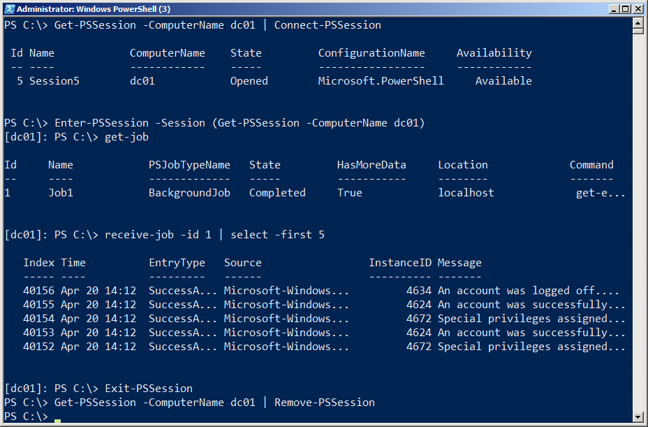
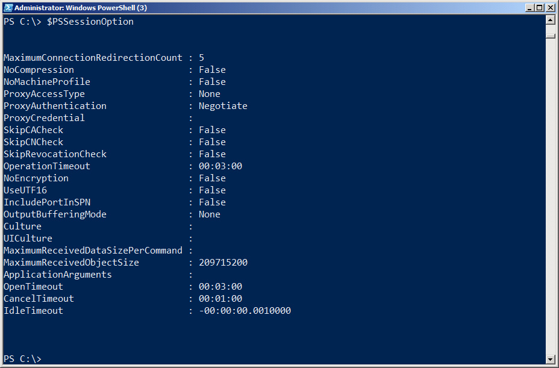
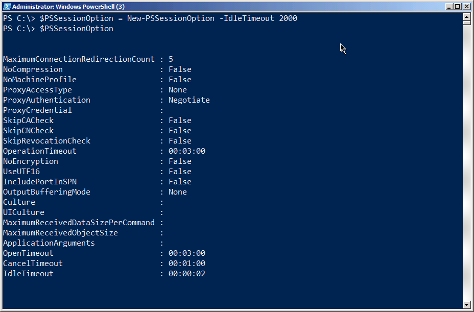
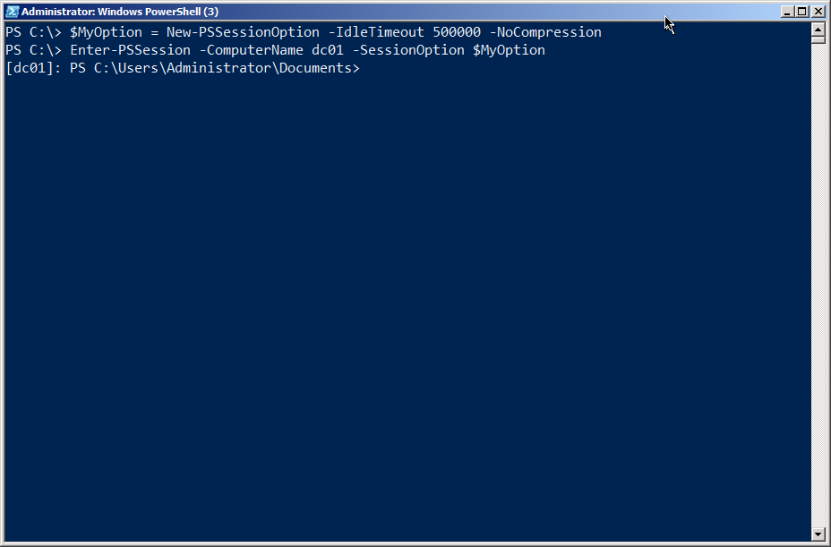

# Session Management

When you create a Remoting connection between two machines, you're creating - in PowerShell terminology - a session. There are an incredible number of options that can be applied to these sessions, and in this portion of the guide we'll walk you through them.

## Ad-Hoc vs. Persistent Sessions

When you use a Remoting command - primarily Invoke-Command or Enter-PSSession - and specify a computer name by using their -ComputerName parameter, you're creating an ad-hoc session. Basically, PowerShell just brings up a session, utilizes it, and then tears it down, all automatically.

Alternately, you can use New-PSSession to explicitly create a new session, which can then be utilized by passing the session to the -Session parameter of Invoke-Command, Enter-PSSession, and numerous other Remoting-aware commands. When you manually create a session, it's up to you to get rid of it when you're done with it. However, if you have a session open and close your copy of PowerShell, that session is automatically removed for you - so you're not leaving anything hanging around that needs to be cleaned up.

## Disconnecting and Reconnecting Sessions

In PowerShell v3, you can disconnect and reconnect sessions by using Disconnect-PSSession and Connect-PSSession. These commands each accept a session object, which you'd usually create with New-PSSession.

A disconnected session leaves a copy of PowerShell up and running on the remote computer. This is a good way to get it to run some long-running task, disconnect, and then reconnect later to check up on it. You can even disconnect a session on one computer, move to another computer, and reconnect to that session (although you can't connect to someone else's disconnect session; you're limited to reconnecting to your own).

For example, figure 5.1 shows a session being created from a client to a server. The session is then given a task to perform as a background job, and then the session is disconnected. It's important to note that the command, and the background job, are on the server (DC01), not the client.

Figure 5.1: Creating, using, and disconnecting a session

In figure 5.2, we've moved to a different machine. We're logged on, and running PowerShell, as the same user that we were on the previous client computer. We retrieve the session from the remote computer, and then reconnect it. We then enter the newly reconnected session, display that background job, and receive some results from it. Finally, we exit the remote session and shut it down via Remove-PSSession.

Figure 5.2: Reconnecting to, utilizing, and removing a session

Obviously, disconnected sessions can present something of a management concern, because you're leaving a copy of PowerShell up and running on a remote machine - and you're doing so in a way that makes it difficult for someone else to even see you've done it! That's where session options come into play.

## Session Options

Whenever you run a Remoting command that creates a session - whether persistent or ad-hoc - you have the option of specifying a -SessionOption parameter, which accepts a PSSessionOption object. The default option object is used if you don't specify one, and that object can be found in the built-in $PSSessionOption variable. It's shown in figure 5.3.

Figure 5.3: The default PSSessionOption object stored in $PSSessionOption

As you can see, this specifies a number of defaults, including the operation timeout, idle timeout, and other options. You can change these by simply creating a new session option object and assigning it to $PSSessionOption; note that you need to do this in a profile script if you want your changes to become the new default every time you open a new copy of PowerShell. Figure 5.4 shows an example.

Figure 5.4: Creating a new default PSSessionOption object

Of course, a 2-second idle timeout probably isn't very practical (and in fact won't work - you must specify at least a 60-second timeout in order to use the session object at all), but you'll note that you only need to specify the option parameters that you want to change - everything else will go to the built-in defaults. You can also specify a unique session option for any given session you create. Figure 5.5 shows one way to do so.

Figure 5.5: Creating a new PSSessionOption object to use with a 1-to-1 connection

By specifying intelligent values for these various options, you can help ensure that disconnected sessions don't hang around and run forever and ever. A reasonable idle timeout, for example, ensures that the session will eventually close itself, even if an administrator disconnects from it and subsequently forgets about it. Note that, when a session closes itself, any data within that session - including background job results - will be lost. It's probably a good idea to get in the practice of having data saved into a file (by using Export-CliXML, for example), so that an idle session doesn't close itself and lose all of your work.

